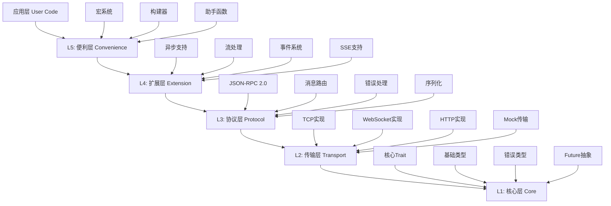
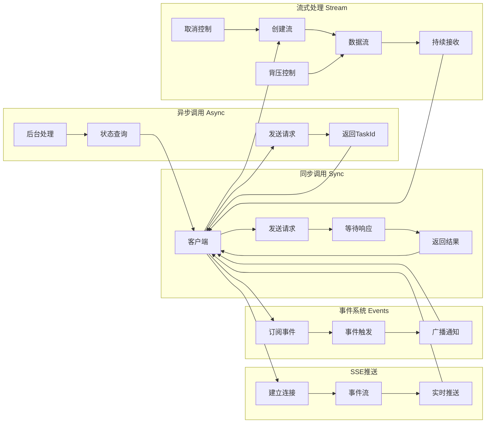
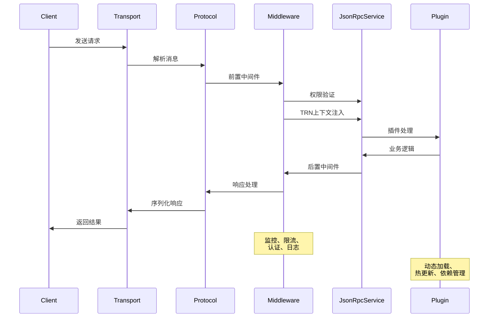
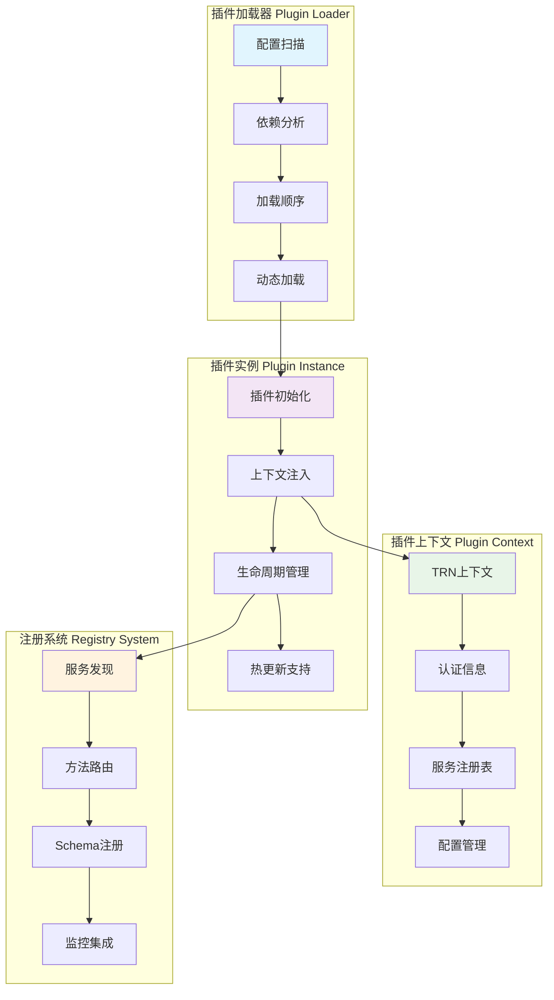

# jsonrpc-rust 底层通用库设计文档

## 1. 项目定位与目标

### 1.1 项目定位
jsonrpc-rust是一个**底层通用JSON-RPC库**，作为其他工具开发的基础设施。它不是应用框架，而是提供稳定、高性能、可扩展的JSON-RPC通信能力。

### 1.2 设计目标
- **通用性**: 支持各种工具开发场景
- **性能**: 零成本抽象，高并发处理
- **扩展性**: 插件化架构，支持自定义扩展
- **稳定性**: 作为底层基础设施的可靠性
- **易用性**: 简洁明了的API设计

### 1.3 使用场景
```rust
// 场景1: 开发同步工具
#[jsonrpc_tool]
impl WeatherTool {
    #[rpc_method]
    pub fn get_weather(&self, city: String) -> Result<Weather, Error> { ... }
}

// 场景2: 开发异步工具  
#[jsonrpc_tool]
impl AITool {
    #[rpc_async]
    pub async fn generate_text(&self, prompt: String) -> Result<TaskId, Error> { ... }
}

// 场景3: 开发流式工具
#[jsonrpc_tool] 
impl DataProcessor {
    #[rpc_stream]
    pub fn process_stream(&self, input: StreamParams) -> impl Stream<Item = Data> { ... }
}

// 场景4: 工具间互调用
let client = JsonRpcClient::connect("tool-service:8080").await?;
let result = client.call("method_name", params).await?;
```

## 2. 整体架构设计

### 2.1 分层架构

```
┌─────────────────────────────────────────────────────────────┐
│                    应用层 (User Code)                        │
├─────────────────────────────────────────────────────────────┤
│  L5: 便利层 (Convenience Layer)                              │
│      - 宏系统 (Macros)                                       │
│      - 构建器 (Builders)                                     │  
│      - 助手函数 (Helpers)                                    │
├─────────────────────────────────────────────────────────────┤
│  L4: 扩展层 (Extension Layer)                                │
│      - 异步支持 (Async)                                      │
│      - 流处理 (Streaming)                                    │
│      - 事件系统 (Events)                                     │
│      - SSE支持 (SSE)                                         │
├─────────────────────────────────────────────────────────────┤
│  L3: 协议层 (Protocol Layer)                                 │
│      - JSON-RPC 2.0 核心                                     │
│      - 消息路由                                              │
│      - 错误处理                                              │
│      - 序列化/反序列化                                        │
├─────────────────────────────────────────────────────────────┤
│  L2: 传输层 (Transport Layer)                                │
│      - 传输抽象                                              │
│      - TCP实现                                               │
│      - WebSocket实现                                         │
│      - HTTP实现                                              │
├─────────────────────────────────────────────────────────────┤
│  L1: 核心层 (Core Layer)                                     │
│      - 核心Trait定义                                         │
│      - 基础类型                                              │
│      - 错误类型                                              │
│      - Future/Stream抽象                                     │
└─────────────────────────────────────────────────────────────┘
```

### 2.2 模块组织

```
src/
├── core/                   # L1: 核心层
│   ├── mod.rs
│   ├── traits.rs          # 核心trait定义
│   ├── types.rs           # 基础类型定义
│   ├── error.rs           # 错误类型系统
│   └── future.rs          # Future/Stream抽象
├── transport/              # L2: 传输层
│   ├── mod.rs
│   ├── abstraction.rs     # 传输抽象trait
│   ├── tcp.rs             # TCP实现
│   ├── websocket.rs       # WebSocket实现
│   ├── http.rs            # HTTP实现
│   └── registry.rs        # 传输注册表
├── protocol/               # L3: 协议层
│   ├── mod.rs
│   ├── jsonrpc.rs         # JSON-RPC 2.0实现
│   ├── router.rs          # 消息路由
│   ├── serializer.rs      # 序列化处理
│   └── validator.rs       # 消息验证
├── extension/              # L4: 扩展层
│   ├── mod.rs
│   ├── async_support.rs   # 异步任务支持
│   ├── streaming.rs       # 流处理支持
│   ├── events.rs          # 事件系统
│   ├── sse.rs             # SSE支持
│   └── batch.rs           # 批处理支持
├── convenience/            # L5: 便利层
│   ├── mod.rs
│   ├── macros.rs          # 宏定义
│   ├── builder.rs         # 构建器模式
│   ├── client.rs          # 客户端便利API
│   └── server.rs          # 服务端便利API
└── lib.rs                  # 库入口
```

## 3. 核心概念设计

### 3.1 核心Trait系统

```rust
// 消息抽象
pub trait Message: Send + Sync + 'static {
    type Id;
    type Payload;
    type Error;
    type Metadata: MessageMetadata;
}

// 传输抽象
#[async_trait]
pub trait Transport: Send + Sync + 'static {
    type Message: Message;
    type Connection: Connection<Message = Self::Message>;
    type Error: Error + Send + Sync + 'static;
    
    async fn bind(&self, addr: &str) -> Result<Self::Connection, Self::Error>;
    async fn connect(&self, addr: &str) -> Result<Self::Connection, Self::Error>;
    async fn create_mock(&self) -> Self::Connection; // 用于测试
}

// 连接抽象（支持流控制）
#[async_trait] 
pub trait Connection: Send + Sync + 'static {
    type Message: Message;
    type Error: Error + Send + Sync + 'static;
    
    async fn send(&mut self, message: Self::Message) -> Result<(), Self::Error>;
    async fn recv(&mut self) -> Result<Option<Self::Message>, Self::Error>;
    async fn close(&mut self) -> Result<(), Self::Error>;
    
    // 流控制支持
    fn set_backpressure_limit(&mut self, limit: usize);
    fn get_pending_count(&self) -> usize;
    async fn wait_for_capacity(&self) -> Result<(), Self::Error>;
}

// 统一的服务抽象（合并Handler和Service）
#[async_trait]
pub trait JsonRpcService: Send + Sync + 'static {
    type Context: ServiceContext;
    type Error: Error + Send + Sync + 'static;
    
    /// 获取服务信息和JSON Schema
    fn service_info(&self) -> ServiceInfo;
    
    /// 处理JSON-RPC调用
    async fn call(
        &self,
        method: &str,
        params: Value,
        context: &Self::Context,
    ) -> Result<ServiceResponse, Self::Error>;
    
    /// 创建流式响应
    async fn create_stream(
        &self,
        method: &str,
        params: Value,
        context: &Self::Context,
    ) -> Result<ServiceStream, Self::Error>;
    
    /// 健康检查
    async fn health_check(&self) -> HealthStatus {
        HealthStatus::Healthy
    }
}

// 服务响应类型
#[derive(Debug)]
pub enum ServiceResponse {
    /// 同步响应
    Immediate(Value),
    /// 异步任务
    Task { task_id: String, status_url: Option<String> },
    /// 事件发布确认
    Event { event_id: String, subscribers: u64 },
    /// 流式响应开始
    StreamStarted { stream_id: String },
    /// SSE响应开始
    SseStarted { stream_id: String, content_type: String },
}

// 服务流抽象（支持取消和背压）
#[async_trait]
pub trait ServiceStream: Send + Sync + 'static {
    type Item: Send + Sync;
    type Error: Error + Send + Sync;
    
    async fn next(&mut self) -> Option<Result<Self::Item, Self::Error>>;
    async fn cancel(&mut self) -> Result<(), Self::Error>;
    fn is_cancelled(&self) -> bool;
    
    // 背压控制
    fn set_buffer_size(&mut self, size: usize);
    async fn wait_for_consumer(&self) -> Result<(), Self::Error>;
}
```

### 3.2 消息类型系统

```rust
// 消息元数据trait（支持TRN集成）
pub trait MessageMetadata: Send + Sync + Clone {
    fn correlation_id(&self) -> Option<&str>;
    fn timestamp(&self) -> SystemTime;
    fn trn_context(&self) -> Option<&TrnContext>; // 集成TRN系统
    fn auth_context(&self) -> Option<&AuthContext>;
    fn trace_context(&self) -> Option<&TraceContext>;
}

// TRN上下文（集成用户的TRN系统）
#[derive(Debug, Clone, Serialize, Deserialize)]
pub struct TrnContext {
    /// 工具资源名称（来自用户的trn-rust库）
    pub tool_trn: String, // 如: "trn:user:alice:tool:weather-api:v1.0"
    /// 调用者TRN
    pub caller_trn: Option<String>,
    /// 租户信息
    pub tenant_id: Option<String>,
    /// 命名空间
    pub namespace: Option<String>,
    /// 权限范围
    pub scope: Vec<String>,
}

// 权限上下文
#[derive(Debug, Clone)]
pub struct AuthContext {
    pub user_id: Option<String>,
    pub session_id: Option<String>,
    pub permissions: Vec<Permission>,
    pub roles: Vec<String>,
    pub token: Option<String>,
    pub expires_at: Option<SystemTime>,
}

// 权限定义
#[derive(Debug, Clone, Serialize, Deserialize)]
pub struct Permission {
    pub resource: String, // 可以是TRN格式
    pub actions: Vec<String>, // read, write, execute, etc.
}

// 统一消息类型（使用trait object dispatch）
pub trait JsonRpcMessageType: Send + Sync + DynClone {
    fn message_type(&self) -> &'static str;
    fn serialize(&self) -> Result<Vec<u8>, SerializationError>;
    fn metadata(&self) -> &dyn MessageMetadata;
}

// 具体消息类型
#[derive(Debug, Clone, Serialize, Deserialize)]
pub struct JsonRpcRequest {
    pub jsonrpc: String,
    pub method: String,
    pub params: Option<Value>,
    pub id: Option<Value>,
    pub metadata: StandardMetadata,
}

#[derive(Debug, Clone, Serialize, Deserialize)]
pub struct JsonRpcResponse {
    pub jsonrpc: String,
    pub result: Option<Value>,
    pub error: Option<JsonRpcError>,
    pub id: Value,
    pub metadata: StandardMetadata,
}

#[derive(Debug, Clone, Serialize, Deserialize)]
pub struct StreamMessage {
    pub stream_id: String,
    pub sequence: u64,
    pub data: Value,
    pub is_final: bool,
    pub metadata: StandardMetadata,
}

#[derive(Debug, Clone, Serialize, Deserialize)]
pub struct EventMessage {
    pub event_id: String,
    pub event_type: String,
    pub source_trn: Option<String>, // 事件源TRN
    pub data: Value,
    pub metadata: StandardMetadata,
}

// 标准元数据实现
#[derive(Debug, Clone, Serialize, Deserialize)]
pub struct StandardMetadata {
    pub correlation_id: Option<String>,
    pub timestamp: SystemTime,
    pub trn_context: Option<TrnContext>,
    pub auth_context: Option<AuthContext>,
    pub trace_context: Option<TraceContext>,
    pub timeout: Option<Duration>,
    pub priority: u8,
}

impl MessageMetadata for StandardMetadata {
    fn correlation_id(&self) -> Option<&str> {
        self.correlation_id.as_deref()
    }
    
    fn timestamp(&self) -> SystemTime {
        self.timestamp
    }
    
    fn trn_context(&self) -> Option<&TrnContext> {
        self.trn_context.as_ref()
    }
    
    fn auth_context(&self) -> Option<&AuthContext> {
        self.auth_context.as_ref()
    }
    
    fn trace_context(&self) -> Option<&TraceContext> {
        self.trace_context.as_ref()
    }
}
```

### 3.3 错误处理系统

```rust
// 统一错误类型
#[derive(Debug, thiserror::Error)]
pub enum JsonRpcError {
    // 标准JSON-RPC错误
    #[error("Parse error")]
    ParseError,
    
    #[error("Invalid request")]
    InvalidRequest,
    
    #[error("Method not found: {method}")]
    MethodNotFound { method: String },
    
    #[error("Invalid params: {message}")]
    InvalidParams { message: String },
    
    #[error("Internal error: {message}")]
    InternalError { message: String },
    
    // 传输层错误
    #[error("Transport error: {source}")]
    Transport { source: Box<dyn Error + Send + Sync> },
    
    // 扩展错误
    #[error("Async task error: {message}")]
    AsyncTask { message: String },
    
    #[error("Stream error: {message}")]
    Stream { message: String },
    
    #[error("Timeout: {duration:?}")]
    Timeout { duration: Duration },
}

// 错误码映射
impl JsonRpcError {
    pub fn error_code(&self) -> i32 {
        match self {
            JsonRpcError::ParseError => -32700,
            JsonRpcError::InvalidRequest => -32600,
            JsonRpcError::MethodNotFound { .. } => -32601,
            JsonRpcError::InvalidParams { .. } => -32602,
            JsonRpcError::InternalError { .. } => -32603,
            JsonRpcError::Transport { .. } => -32001,
            JsonRpcError::AsyncTask { .. } => -32002,
            JsonRpcError::Stream { .. } => -32003,
            JsonRpcError::Timeout { .. } => -32004,
        }
    }
}
```

## 4. 通信模式设计

### 4.1 同步调用模式

```rust
// 基础同步调用
pub trait SyncCall {
    type Params: Serialize;
    type Result: DeserializeOwned;
    type Error: Error;
    
    fn call(&self, method: &str, params: Self::Params) -> Result<Self::Result, Self::Error>;
}

// 异步版本
#[async_trait]
pub trait AsyncCall {
    type Params: Serialize + Send;
    type Result: DeserializeOwned + Send;
    type Error: Error + Send;
    
    async fn call(&self, method: &str, params: Self::Params) -> Result<Self::Result, Self::Error>;
}
```

### 4.2 异步任务模式

```rust
// 异步任务抽象
pub trait AsyncTask {
    type TaskId: Clone + Send + Sync;
    type Result: Send;
    type Error: Error + Send;
    
    fn submit(&self, method: &str, params: Value) -> impl Future<Output = Result<Self::TaskId, Self::Error>>;
    fn query(&self, task_id: &Self::TaskId) -> impl Future<Output = Result<TaskStatus<Self::Result>, Self::Error>>;
    fn cancel(&self, task_id: &Self::TaskId) -> impl Future<Output = Result<(), Self::Error>>;
}

#[derive(Debug, Clone)]
pub enum TaskStatus<T> {
    Pending,
    Running { progress: Option<f32> },
    Completed { result: T },
    Failed { error: String },
    Cancelled,
}
```

### 4.3 流式处理模式

```rust
// 流抽象
pub trait JsonRpcStream {
    type Item: Send;
    type Error: Error + Send;
    
    fn stream(
        &self, 
        method: &str, 
        params: Value
    ) -> impl Stream<Item = Result<Self::Item, Self::Error>>;
}

// 双向流
pub trait BidirectionalStream {
    type Input: Send;
    type Output: Send;
    type Error: Error + Send;
    
    fn start_stream(
        &self,
        method: &str,
        params: Value,
    ) -> impl Future<Output = Result<(
        Sink<Self::Input>, 
        Stream<Item = Result<Self::Output, Self::Error>>
    ), Self::Error>>;
}
```

### 4.4 事件发布订阅模式

```rust
// 事件发布者
#[async_trait]
pub trait EventPublisher {
    type Event: Send + Sync;
    type Error: Error + Send;
    
    async fn publish(&self, event: Self::Event) -> Result<(), Self::Error>;
    async fn publish_to(&self, target: &str, event: Self::Event) -> Result<(), Self::Error>;
}

// 事件订阅者
#[async_trait] 
pub trait EventSubscriber {
    type Event: Send;
    type Error: Error + Send;
    type Subscription: Send;
    
    async fn subscribe(
        &self, 
        pattern: &str
    ) -> Result<Self::Subscription, Self::Error>;
    
    async fn unsubscribe(&self, subscription: Self::Subscription) -> Result<(), Self::Error>;
}
```

### 4.5 SSE模式

```rust
// SSE事件流
pub trait SseEventStream {
    type Event: Send;
    type Error: Error + Send;
    
    fn event_stream(
        &self,
        method: &str,
        params: Value,
    ) -> impl Stream<Item = Result<SseEvent<Self::Event>, Self::Error>>;
}

#[derive(Debug, Clone)]
pub struct SseEvent<T> {
    pub id: Option<String>,
    pub event_type: Option<String>,
    pub data: T,
    pub retry: Option<Duration>,
}
```

## 5. 高性能编解码系统

### 5.1 性能优化编解码

```rust
// 高性能序列化trait
pub trait HighPerformanceCodec: Send + Sync + 'static {
    type Error: Error + Send + Sync;
    
    /// 使用SIMD-JSON进行快速解析
    fn decode_fast(&self, data: &[u8]) -> Result<Value, Self::Error>;
    
    /// 零拷贝序列化到缓冲区
    fn encode_zero_copy(&self, value: &Value, buf: &mut BytesMut) -> Result<(), Self::Error>;
    
    /// 流式解析大型JSON
    fn decode_streaming(&self, reader: impl Read) -> impl Iterator<Item = Result<Value, Self::Error>>;
    
    /// 批量编码（向量化）
    fn encode_batch(&self, values: &[Value]) -> Result<Vec<u8>, Self::Error>;
}

// SIMD-JSON实现
pub struct SimdJsonCodec {
    use_pretty: bool,
    buffer_pool: BufferPool,
}

impl HighPerformanceCodec for SimdJsonCodec {
    type Error = CodecError;
    
    fn decode_fast(&self, data: &[u8]) -> Result<Value, Self::Error> {
        // 使用simd-json crate进行快速解析
        let mut owned_data = data.to_vec();
        simd_json::to_borrowed_value(&mut owned_data)
            .map_err(|e| CodecError::SimdJsonError(e))
    }
    
    fn encode_zero_copy(&self, value: &Value, buf: &mut BytesMut) -> Result<(), Self::Error> {
        // 直接写入到BytesMut，避免中间分配
        let writer = buf.writer();
        serde_json::to_writer(writer, value)
            .map_err(|e| CodecError::SerdeError(e))
    }
    
    // 其他实现...
}

// 缓冲区池管理
pub struct BufferPool {
    small_pool: Pool<Vec<u8>>,    // 4KB
    medium_pool: Pool<Vec<u8>>,   // 64KB
    large_pool: Pool<Vec<u8>>,    // 1MB
}

impl BufferPool {
    pub fn get_buffer(&self, size_hint: usize) -> PooledBuffer {
        match size_hint {
            0..=4096 => PooledBuffer::Small(self.small_pool.get()),
            4097..=65536 => PooledBuffer::Medium(self.medium_pool.get()),
            _ => PooledBuffer::Large(self.large_pool.get()),
        }
    }
}
```

### 5.2 JSON Schema工具注册

```rust
// 工具描述和Schema
#[derive(Debug, Clone, Serialize, Deserialize)]
pub struct ServiceInfo {
    pub name: String,
    pub version: String,
    pub description: String,
    pub trn: String, // 工具的TRN标识
    pub methods: HashMap<String, MethodSchema>,
    pub events: HashMap<String, EventSchema>,
    pub streams: HashMap<String, StreamSchema>,
    pub metadata: ServiceMetadata,
}

// 方法Schema
#[derive(Debug, Clone, Serialize, Deserialize)]
pub struct MethodSchema {
    pub description: String,
    pub parameters_schema: Option<Value>, // JSON Schema
    pub returns_schema: Option<Value>,    // JSON Schema
    pub examples: Vec<MethodExample>,
    pub execution_type: ExecutionType,
    pub auth_required: bool,
    pub permissions: Vec<String>,
}

#[derive(Debug, Clone, Serialize, Deserialize)]
pub enum ExecutionType {
    Sync { timeout_ms: Option<u64> },
    Async { 
        expected_duration_ms: Option<u64>,
        progress_updates: bool,
    },
    Stream { 
        backpressure_supported: bool,
        cancellation_supported: bool,
    },
    Event { fire_and_forget: bool },
}

// Schema注册表
pub struct SchemaRegistry {
    schemas: DashMap<String, ServiceInfo>, // key: TRN
    schema_validator: jsonschema::JSONSchema,
}

impl SchemaRegistry {
    pub fn register_service(&self, info: ServiceInfo) -> Result<(), SchemaError> {
        // 验证Schema有效性
        self.validate_service_schema(&info)?;
        
        // 注册到TRN索引
        self.schemas.insert(info.trn.clone(), info);
        Ok(())
    }
    
    pub fn get_service_by_trn(&self, trn: &str) -> Option<ServiceInfo> {
        self.schemas.get(trn).map(|entry| entry.clone())
    }
    
    pub fn discover_services(&self, pattern: &str) -> Vec<ServiceInfo> {
        // 支持TRN模式匹配
        self.schemas.iter()
            .filter(|entry| self.matches_trn_pattern(entry.key(), pattern))
            .map(|entry| entry.value().clone())
            .collect()
    }
    
    pub fn validate_method_call(
        &self,
        trn: &str,
        method: &str,
        params: &Value,
    ) -> Result<(), ValidationError> {
        // 根据Schema验证参数
        // 检查权限要求
        // 验证TRN权限范围
    }
}
```

## 6. 扩展系统设计

### 6.1 动态插件系统（支持热加载）

```rust
// 动态插件接口
pub trait DynamicPlugin: Send + Sync + 'static {
    fn name(&self) -> &str;
    fn version(&self) -> &str;
    fn dependencies(&self) -> Vec<PluginDependency>;
    
    fn initialize(&mut self, context: &mut PluginContext) -> Result<(), PluginError>;
    fn shutdown(&mut self) -> Result<(), PluginError>;
    
    // 热重载支持
    fn can_reload(&self) -> bool { false }
    fn before_reload(&mut self) -> Result<PluginState, PluginError>;
    fn after_reload(&mut self, state: PluginState) -> Result<(), PluginError>;
}

// 插件依赖定义
#[derive(Debug, Clone)]
pub struct PluginDependency {
    pub name: String,
    pub version_requirement: String, // semver格式
    pub optional: bool,
}

// 插件状态（用于热重载）
pub type PluginState = HashMap<String, Value>;

// 动态插件管理器
pub struct DynamicPluginManager {
    plugins: DashMap<String, PluginInstance>,
    dependency_graph: DependencyGraph,
    loader: PluginLoader,
}

// 插件实例
struct PluginInstance {
    plugin: Box<dyn DynamicPlugin>,
    library: Option<libloading::Library>, // 动态库句柄
    state: PluginInstanceState,
}

#[derive(Debug)]
enum PluginInstanceState {
    Loaded,
    Initialized,
    Running,
    Stopping,
    Failed(String),
}

// 插件加载器
pub struct PluginLoader {
    search_paths: Vec<PathBuf>,
    security_policy: SecurityPolicy,
}

impl PluginLoader {
    /// 动态加载插件
    pub unsafe fn load_plugin(&self, path: &Path) -> Result<Box<dyn DynamicPlugin>, PluginError> {
        // 安全检查
        self.security_policy.validate_plugin(path)?;
        
        // 加载动态库
        let lib = libloading::Library::new(path)?;
        
        // 获取插件入口点
        let create_plugin: Symbol<unsafe extern "C" fn() -> *mut dyn DynamicPlugin> = 
            lib.get(b"create_plugin")?;
        
        let plugin_ptr = create_plugin();
        if plugin_ptr.is_null() {
            return Err(PluginError::InvalidPlugin);
        }
        
        Ok(Box::from_raw(plugin_ptr))
    }
    
    /// 热重载插件
    pub async fn reload_plugin(&self, name: &str) -> Result<(), PluginError> {
        // 实现热重载逻辑
        // 1. 保存当前状态
        // 2. 卸载旧插件
        // 3. 加载新插件
        // 4. 恢复状态
    }
}

// 安全策略
#[derive(Debug, Clone)]
pub struct SecurityPolicy {
    pub allowed_paths: Vec<PathBuf>,
    pub signature_verification: bool,
    pub sandbox_enabled: bool,
}
```

### 6.2 权限中间件系统

```rust
// 权限验证中间件
pub struct AuthMiddleware {
    auth_provider: Box<dyn AuthProvider>,
    permission_checker: Box<dyn PermissionChecker>,
}

#[async_trait]
impl Middleware<JsonRpcRequest, JsonRpcResponse> for AuthMiddleware {
    type Error = AuthError;
    
    async fn call(
        &self,
        request: JsonRpcRequest,
        next: Next<JsonRpcRequest, JsonRpcResponse>,
    ) -> Result<JsonRpcResponse, Self::Error> {
        // 1. 验证身份
        let auth_context = self.extract_auth_context(&request)?;
        let user = self.auth_provider.authenticate(&auth_context).await?;
        
        // 2. 检查权限
        let required_permissions = self.get_required_permissions(&request)?;
        self.permission_checker.check_permissions(&user, &required_permissions).await?;
        
        // 3. 增强请求上下文
        let mut enhanced_request = request;
        enhanced_request.metadata.auth_context = Some(AuthContext {
            user_id: Some(user.id),
            permissions: user.permissions,
            roles: user.roles,
            session_id: auth_context.session_id,
            token: auth_context.token,
            expires_at: user.expires_at,
        });
        
        // 4. 继续处理
        next.call(enhanced_request).await
    }
}

// 身份提供者trait
#[async_trait]
pub trait AuthProvider: Send + Sync {
    async fn authenticate(&self, context: &AuthContext) -> Result<User, AuthError>;
    async fn refresh_token(&self, refresh_token: &str) -> Result<TokenPair, AuthError>;
    async fn revoke_session(&self, session_id: &str) -> Result<(), AuthError>;
}

// 权限检查器trait
#[async_trait]
pub trait PermissionChecker: Send + Sync {
    async fn check_permissions(
        &self,
        user: &User,
        required: &[Permission],
    ) -> Result<(), AuthError>;
    
    async fn check_trn_access(
        &self,
        user: &User,
        target_trn: &str,
        action: &str,
    ) -> Result<(), AuthError>;
}

// TRN权限检查器实现
pub struct TrnPermissionChecker {
    trn_parser: trn_rust::TrnParser, // 集成用户的TRN库
}

impl TrnPermissionChecker {
    async fn check_trn_access(
        &self,
        user: &User,
        target_trn: &str,
        action: &str,
    ) -> Result<(), AuthError> {
        // 解析目标TRN
        let target = self.trn_parser.parse(target_trn)?;
        
        // 检查用户权限中是否有匹配的TRN模式
        for permission in &user.permissions {
            if let Ok(pattern) = self.trn_parser.parse(&permission.resource) {
                if self.trn_matches(&target, &pattern) && 
                   permission.actions.contains(&action.to_string()) {
                    return Ok(());
                }
            }
        }
        
        Err(AuthError::InsufficientPermissions {
            required: format!("{}:{}", target_trn, action),
            available: user.permissions.clone(),
        })
    }
    
    fn trn_matches(&self, target: &trn_rust::Trn, pattern: &trn_rust::Trn) -> bool {
        // 实现TRN模式匹配逻辑
        // 支持通配符、命名空间继承等
        target.matches_pattern(&pattern.to_string())
    }
}
```

### 6.3 测试框架和Mock系统

```rust
// Mock传输实现
pub struct MockTransport {
    message_queue: Arc<Mutex<VecDeque<MockMessage>>>,
    response_handlers: Arc<DashMap<String, MockResponseHandler>>,
    latency_simulation: Option<Duration>,
    failure_rate: f32, // 0.0 - 1.0
}

impl MockTransport {
    pub fn new() -> Self {
        Self {
            message_queue: Arc::new(Mutex::new(VecDeque::new())),
            response_handlers: Arc::new(DashMap::new()),
            latency_simulation: None,
            failure_rate: 0.0,
        }
    }
    
    /// 设置模拟延迟
    pub fn with_latency(mut self, latency: Duration) -> Self {
        self.latency_simulation = Some(latency);
        self
    }
    
    /// 设置失败率（用于混沌测试）
    pub fn with_failure_rate(mut self, rate: f32) -> Self {
        self.failure_rate = rate.clamp(0.0, 1.0);
        self
    }
    
    /// 添加预设响应
    pub fn expect_call(&self, method: &str, response: MockResponse) {
        self.response_handlers.insert(
            method.to_string(),
            MockResponseHandler::Fixed(response),
        );
    }
    
    /// 添加动态响应处理器
    pub fn on_call<F>(&self, method: &str, handler: F)
    where
        F: Fn(&Value) -> MockResponse + Send + Sync + 'static,
    {
        self.response_handlers.insert(
            method.to_string(),
            MockResponseHandler::Dynamic(Box::new(handler)),
        );
    }
}

#[async_trait]
impl Transport for MockTransport {
    type Message = JsonRpcMessage;
    type Connection = MockConnection;
    type Error = MockError;
    
    async fn bind(&self, _addr: &str) -> Result<Self::Connection, Self::Error> {
        Ok(MockConnection::new(self.message_queue.clone()))
    }
    
    async fn connect(&self, _addr: &str) -> Result<Self::Connection, Self::Error> {
        Ok(MockConnection::new(self.message_queue.clone()))
    }
    
    async fn create_mock(&self) -> Self::Connection {
        MockConnection::new(self.message_queue.clone())
    }
}

// Fuzz测试支持
pub struct FuzzTester {
    target_service: Arc<dyn JsonRpcService>,
    schema_registry: Arc<SchemaRegistry>,
    input_generator: InputGenerator,
}

impl FuzzTester {
    pub async fn run_fuzz_test(&self, iterations: usize) -> FuzzResult {
        let mut results = FuzzResult::new();
        
        for i in 0..iterations {
            // 生成随机输入
            let fuzz_input = self.input_generator.generate();
            
            // 执行测试
            let start = Instant::now();
            let result = self.target_service.call(
                &fuzz_input.method,
                fuzz_input.params,
                &fuzz_input.context,
            ).await;
            let duration = start.elapsed();
            
            // 记录结果
            results.record_test(i, fuzz_input, result, duration);
            
            // 检查内存泄漏、性能退化等
            self.check_invariants(&mut results).await;
        }
        
        results
    }
}

// 集成测试助手
pub struct IntegrationTestBuilder {
    services: Vec<Box<dyn JsonRpcService>>,
    mock_transport: MockTransport,
    test_scenarios: Vec<TestScenario>,
}

impl IntegrationTestBuilder {
    pub fn new() -> Self {
        Self {
            services: Vec::new(),
            mock_transport: MockTransport::new(),
            test_scenarios: Vec::new(),
        }
    }
    
    pub fn add_service(mut self, service: Box<dyn JsonRpcService>) -> Self {
        self.services.push(service);
        self
    }
    
    pub fn scenario(mut self, scenario: TestScenario) -> Self {
        self.test_scenarios.push(scenario);
        self
    }
    
    pub async fn run_tests(self) -> TestResults {
        // 执行所有测试场景
        // 验证服务间交互
        // 生成测试报告
    }
}
```

### 6.4 插件架构

```rust
// 插件trait
pub trait Plugin: Send + Sync + 'static {
    fn name(&self) -> &str;
    fn version(&self) -> &str;
    fn initialize(&mut self, context: &mut PluginContext) -> Result<(), Box<dyn Error>>;
    fn shutdown(&mut self) -> Result<(), Box<dyn Error>>;
}

// 插件上下文
pub struct PluginContext {
    transports: TransportRegistry,
    handlers: HandlerRegistry,
    middleware: MiddlewareStack,
    config: ConfigMap,
}

// 插件注册表
pub struct PluginRegistry {
    plugins: HashMap<String, Box<dyn Plugin>>,
}

impl PluginRegistry {
    pub fn register<P: Plugin>(&mut self, plugin: P) -> Result<(), PluginError> { ... }
    pub fn unregister(&mut self, name: &str) -> Result<(), PluginError> { ... }
    pub fn initialize_all(&mut self) -> Result<(), PluginError> { ... }
}
```

### 5.2 中间件系统

```rust
// 中间件trait
#[async_trait]
pub trait Middleware<Req, Resp>: Send + Sync + 'static {
    type Error: Error + Send + Sync;
    
    async fn call(
        &self,
        request: Req,
        next: Next<Req, Resp>,
    ) -> Result<Resp, Self::Error>;
}

// 中间件栈
pub struct MiddlewareStack<Req, Resp> {
    middlewares: Vec<Box<dyn Middleware<Req, Resp>>>,
}

// 内置中间件
pub struct LoggingMiddleware;
pub struct MetricsMiddleware;
pub struct AuthMiddleware;
pub struct RateLimitMiddleware;
pub struct CompressionMiddleware;
```

### 5.3 钩子系统

```rust
// 生命周期钩子
pub trait LifecycleHooks {
    fn on_server_start(&self) -> Result<(), Box<dyn Error>> { Ok(()) }
    fn on_server_stop(&self) -> Result<(), Box<dyn Error>> { Ok(()) }
    fn on_client_connect(&self, client_id: &str) -> Result<(), Box<dyn Error>> { Ok(()) }
    fn on_client_disconnect(&self, client_id: &str) -> Result<(), Box<dyn Error>> { Ok(()) }
    fn on_message_received(&self, message: &dyn Message) -> Result<(), Box<dyn Error>> { Ok(()) }
    fn on_message_sent(&self, message: &dyn Message) -> Result<(), Box<dyn Error>> { Ok(()) }
    fn on_error(&self, error: &dyn Error) -> Result<(), Box<dyn Error>> { Ok(()) }
}
```

## 6. 性能考虑

### 6.1 零成本抽象

- 使用泛型而非trait对象减少动态分发
- 编译时单态化消除运行时开销
- 零拷贝序列化/反序列化
- 内存池和对象池复用

### 6.2 并发处理

```rust
// 异步运行时抽象
pub trait AsyncRuntime: Send + Sync + 'static {
    type Handle: Send + 'static;
    type JoinHandle<T: Send + 'static>: Future<Output = Result<T, JoinError>> + Send;
    
    fn spawn<F, T>(&self, future: F) -> Self::JoinHandle<T>
    where
        F: Future<Output = T> + Send + 'static,
        T: Send + 'static;
        
    fn spawn_blocking<F, T>(&self, f: F) -> Self::JoinHandle<T>
    where
        F: FnOnce() -> T + Send + 'static,
        T: Send + 'static;
}

// 连接池
pub struct ConnectionPool<T: Transport> {
    inner: Arc<PoolInner<T>>,
}

// 负载均衡
pub trait LoadBalancer {
    type Endpoint;
    
    fn next_endpoint(&self) -> Option<Self::Endpoint>;
    fn report_health(&self, endpoint: &Self::Endpoint, healthy: bool);
}
```

### 6.3 内存管理

```rust
// 缓冲区管理
pub struct BufferPool {
    small_buffers: Pool<Vec<u8>>,    // 4KB
    medium_buffers: Pool<Vec<u8>>,   // 64KB  
    large_buffers: Pool<Vec<u8>>,    // 1MB
}

// 零拷贝序列化
pub trait ZeroCopySerialize {
    fn serialize_into(&self, buf: &mut BytesMut) -> Result<(), SerializeError>;
}

pub trait ZeroCopyDeserialize<'de>: Sized {
    fn deserialize_from(buf: &'de [u8]) -> Result<Self, DeserializeError>;
}
```

## 7. 配置和可观测性

### 7.1 配置系统

```rust
// 配置抽象
pub trait Config: Send + Sync + 'static {
    type Error: Error + Send + Sync;
    
    fn get<T: DeserializeOwned>(&self, key: &str) -> Result<Option<T>, Self::Error>;
    fn set<T: Serialize>(&mut self, key: &str, value: T) -> Result<(), Self::Error>;
    fn watch<T: DeserializeOwned>(&self, key: &str) -> impl Stream<Item = Result<T, Self::Error>>;
}

// 服务器配置
#[derive(Debug, Clone, Serialize, Deserialize)]
pub struct ServerConfig {
    pub bind_address: SocketAddr,
    pub max_connections: usize,
    pub request_timeout: Duration,
    pub keepalive_interval: Duration,
    pub buffer_size: usize,
    pub compression: CompressionConfig,
    pub tls: Option<TlsConfig>,
}
```

### 7.2 可观测性

```rust
// 指标收集
pub trait Metrics: Send + Sync + 'static {
    fn inc_counter(&self, name: &str, labels: &[(&str, &str)]);
    fn observe_histogram(&self, name: &str, value: f64, labels: &[(&str, &str)]);
    fn set_gauge(&self, name: &str, value: f64, labels: &[(&str, &str)]);
}

// 链路追踪
pub trait Tracing: Send + Sync + 'static {
    type Span: Send + Sync;
    
    fn start_span(&self, name: &str) -> Self::Span;
    fn current_span(&self) -> Option<Self::Span>;
    fn with_span<F, R>(&self, span: Self::Span, f: F) -> R
    where
        F: FnOnce() -> R;
}

// 健康检查
#[async_trait]
pub trait HealthCheck: Send + Sync + 'static {
    async fn check(&self) -> HealthStatus;
}

#[derive(Debug, Clone)]
pub enum HealthStatus {
    Healthy,
    Degraded { message: String },
    Unhealthy { message: String },
}
```

## 8. 兼容性策略

### 8.1 版本兼容性

- **语义化版本控制**: 遵循SemVer 2.0
- **特性标志**: 使用Cargo features控制可选功能
- **废弃策略**: 渐进式废弃，提供迁移指南
- **向后兼容**: 主版本内保持API兼容

### 8.2 协议兼容性

```rust
// 协议版本协商
pub trait ProtocolNegotiation {
    fn supported_versions(&self) -> &[ProtocolVersion];
    fn negotiate(&self, client_versions: &[ProtocolVersion]) -> Option<ProtocolVersion>;
}

#[derive(Debug, Clone, PartialEq, Eq, PartialOrd, Ord)]
pub struct ProtocolVersion {
    pub major: u32,
    pub minor: u32,
}
```

## 9. 使用示例

### 9.1 服务端开发

```rust
use jsonrpc_rust::*;

// 定义服务
#[derive(Default)]
struct CalculatorService;

#[jsonrpc_impl]
impl CalculatorService {
    #[rpc_method]
    pub fn add(&self, a: i32, b: i32) -> Result<i32, Error> {
        Ok(a + b)
    }
    
    #[rpc_async] 
    pub async fn heavy_calculation(&self, data: Vec<i32>) -> Result<TaskId, Error> {
        let task_id = TaskId::new();
        
        tokio::spawn(async move {
            // 执行重计算
            let result = data.iter().sum::<i32>();
            // 保存结果
        });
        
        Ok(task_id)
    }
    
    #[rpc_stream]
    pub fn fibonacci(&self, n: u32) -> impl Stream<Item = u64> {
        stream! {
            let (mut a, mut b) = (0, 1);
            for _ in 0..n {
                yield a;
                (a, b) = (b, a + b);
            }
        }
    }
}

#[tokio::main]
async fn main() -> Result<(), Box<dyn std::error::Error>> {
    let service = CalculatorService::default();
    
    let server = JsonRpcServer::builder()
        .add_service(service)
        .bind("127.0.0.1:8080")
        .build()
        .await?;
        
    server.serve().await?;
    Ok(())
}
```

### 9.2 客户端调用

```rust
use jsonrpc_rust::*;

#[tokio::main]
async fn main() -> Result<(), Box<dyn std::error::Error>> {
    let client = JsonRpcClient::connect("127.0.0.1:8080").await?;
    
    // 同步调用
    let result: i32 = client.call("add", json!({"a": 1, "b": 2})).await?;
    println!("Add result: {}", result);
    
    // 异步任务
    let task_id: TaskId = client.call("heavy_calculation", json!({"data": [1,2,3,4,5]})).await?;
    let result = client.wait_for_task(task_id).await?;
    println!("Heavy calculation result: {:?}", result);
    
    // 流式调用
    let mut stream = client.stream("fibonacci", json!({"n": 10})).await?;
    while let Some(value) = stream.next().await {
        println!("Fibonacci: {}", value?);
    }
    
    Ok(())
}
```

## 10. 实现计划（更新版）

### Phase 1: 核心基础 (4周)
- [ ] 统一的trait系统（合并Handler/Service）
- [ ] 消息类型系统（支持trait object dispatch）
- [ ] TRN集成和上下文传递
- [ ] 错误处理系统增强
- [ ] JSON-RPC 2.0核心实现

### Phase 2: 传输层与性能 (4周)
- [ ] 传输抽象（支持背压控制）
- [ ] TCP/WebSocket/HTTP传输实现
- [ ] Mock传输（测试支持）
- [ ] 高性能编解码（SIMD-JSON）
- [ ] 缓冲区池管理

### Phase 3: 扩展功能 (5周)
- [ ] 流处理（支持取消和背压）
- [ ] 异步任务管理
- [ ] 事件系统增强
- [ ] SSE支持
- [ ] JSON Schema工具注册

### Phase 4: 权限与安全 (3周)
- [ ] 权限中间件系统
- [ ] TRN权限检查器
- [ ] AuthContext和身份验证
- [ ] 多租户隔离机制
- [ ] 安全策略实现

### Phase 5: 插件系统 (4周)
- [ ] 动态插件接口
- [ ] 热加载支持（libloading）
- [ ] 插件依赖管理
- [ ] 安全沙箱
- [ ] 插件注册表

### Phase 6: 测试框架 (3周)
- [ ] Mock系统完善
- [ ] Fuzz测试框架
- [ ] 集成测试助手
- [ ] 性能基准测试
- [ ] 混沌工程支持

### Phase 7: 便利层 (3周)
- [ ] 宏系统（#[jsonrpc_tool]等）
- [ ] 构建器API
- [ ] 客户端便利API
- [ ] 服务端便利API
- [ ] 文档生成工具

### Phase 8: 可观测性 (2周)
- [ ] 指标收集与TRN标记
- [ ] 分布式链路追踪
- [ ] 健康检查系统
- [ ] 监控面板集成

## 11. 依赖规划

### 11.1 核心依赖
```toml
[dependencies]
# 异步运行时
tokio = { version = "1.0", features = ["full"] }
futures = "0.3"

# 序列化
serde = { version = "1.0", features = ["derive"] }
serde_json = "1.0"
simd-json = { version = "0.13", optional = true }

# 网络和协议
tokio-util = { version = "0.7", features = ["codec"] }
bytes = "1.0"

# 错误处理
thiserror = "1.0"
anyhow = "1.0"

# 并发和数据结构
dashmap = "5.0"
parking_lot = "0.12"

# TRN集成（用户现有库）
trn-rust = { path = "../trn-rust" }

# JSON Schema
jsonschema = "0.17"
schemars = "0.8"

# 权限和安全
jsonwebtoken = "8.0"
argon2 = "0.5"

# 可观测性
tracing = "0.1"
tracing-subscriber = "0.3"
metrics = "0.21"

# 插件系统
libloading = { version = "0.8", optional = true }
semver = "1.0"

# 测试和开发
proptest = { version = "1.0", optional = true }
criterion = { version = "0.5", optional = true }
```

### 11.2 可选特性
```toml
[features]
default = ["simd-json", "high-performance"]

# 性能优化
high-performance = ["simd-json", "parking_lot"]
simd-json = ["dep:simd-json"]

# 插件系统
plugins = ["libloading"]
hot-reload = ["plugins"]

# 测试和开发
testing = ["proptest"]
benchmarks = ["criterion"]

# 协议支持
websockets = ["tokio-tungstenite"]
http = ["hyper", "tower"]

# 安全特性
security = ["jsonwebtoken", "argon2"]

# 可观测性
observability = ["metrics", "tracing-opentelemetry"]

# 完整特性集
full = [
    "high-performance",
    "plugins", 
    "hot-reload",
    "websockets",
    "http",
    "security",
    "observability"
]
```

## 12. 总结

基于您的专业反馈，本设计文档定义了一个**全面增强的分层JSON-RPC通用库**，具备以下核心特性：

### 🎯 核心改进
1. **统一抽象** - 合并Handler/Service为`JsonRpcService`，降低学习曲线
2. **TRN深度集成** - 与您的资源管理规范无缝集成，支持多租户隔离
3. **高性能编解码** - SIMD-JSON、零拷贝、缓冲区池等优化
4. **流控制增强** - 支持取消、背压控制、动态调整
5. **权限系统** - 基于TRN的细粒度权限控制和AuthContext
6. **动态插件** - 热加载、依赖管理、安全沙箱
7. **完整测试** - Mock传输、Fuzz测试、集成测试框架

### 🔧 架构特点
- **5层清晰分层** - 从核心trait到便利API的渐进抽象
- **trait object优化** - 消息类型支持动态分发，提升扩展性  
- **零成本抽象** - 编译时优化，运行时高性能
- **插件化设计** - 所有功能都可通过插件扩展
- **可观测性内置** - 指标、追踪、健康检查开箱即用

### 🚀 使用体验
```rust
// 开发者理想体验 - 简单的事情简单做
#[jsonrpc_tool(trn = "trn:user:alice:tool:weather:v1.0")]
impl WeatherService {
    #[rpc_method(auth_required)]
    pub fn get_weather(&self, city: String) -> Result<Weather, Error> { ... }
    
    #[rpc_stream(cancelable, backpressure)]
    pub fn weather_updates(&self, city: String) -> impl Stream<Item = Update> { ... }
}

// 复杂的事情也能做 - 完整的权限、监控、插件支持
let server = JsonRpcServer::builder()
    .with_trn_context(trn_context)
    .with_auth_middleware(auth_middleware)
    .with_plugin(monitoring_plugin)
    .with_transport(TcpTransport::new())
    .build().await?;
```

### 📊 实现规模
- **8个开发阶段**，总计**28周**
- **从核心trait到完整生态**的渐进交付
- **与现有TRN系统完全兼容**
- **支持渐进迁移和扩展**

## 13. 高级增强特性（可选强化）

### 13.1 🔬 性能评估与基准测试

#### 内置基准测试套件
```rust
// 核心性能指标测试
pub mod benchmarks {
    use criterion::{criterion_group, criterion_main, Criterion};
    
    // Ping-Pong 往返时延测试
    pub fn ping_pong_roundtrip(c: &mut Criterion) {
        c.bench_function("ping_pong_tcp", |b| {
            b.iter(|| async {
                let client = JsonRpcClient::connect("localhost:8080").await?;
                let start = Instant::now();
                let _result = client.call("ping", json!({})).await?;
                start.elapsed()
            })
        });
    }
    
    // 流吞吐量测试
    pub fn stream_throughput(c: &mut Criterion) {
        c.bench_function("stream_1k_messages", |b| {
            b.iter(|| async {
                let mut stream = client.create_stream("data_stream", params).await?;
                let mut count = 0;
                while let Some(_item) = stream.next().await {
                    count += 1;
                    if count >= 1000 { break; }
                }
                count
            })
        });
    }
    
    // 批处理延迟测试
    pub fn batch_latency(c: &mut Criterion) {
        let batch_sizes = vec![1, 10, 100, 1000];
        for size in batch_sizes {
            c.bench_function(&format!("batch_{}", size), |b| {
                b.iter(|| async {
                    let batch = (0..size).map(|i| {
                        Request::new(format!("method_{}", i), json!({"id": i}))
                    }).collect();
                    client.batch_call(batch).await
                })
            });
        }
    }
}

// 基准测试配置
#[derive(Debug, Clone)]
pub struct BenchmarkConfig {
    pub warmup_iterations: u32,
    pub measurement_iterations: u32,
    pub concurrent_connections: u32,
    pub message_sizes: Vec<usize>,
    pub streaming_durations: Vec<Duration>,
}

impl Default for BenchmarkConfig {
    fn default() -> Self {
        Self {
            warmup_iterations: 100,
            measurement_iterations: 1000,
            concurrent_connections: 10,
            message_sizes: vec![64, 1024, 16384, 65536],
            streaming_durations: vec![
                Duration::from_secs(1),
                Duration::from_secs(10),
                Duration::from_secs(60),
            ],
        }
    }
}
```

### 13.2 📊 监控与可观测性增强

#### Prometheus 指标导出器
```rust
use prometheus::{Encoder, TextEncoder, Counter, Histogram, Gauge, Registry};

#[derive(Clone)]
pub struct PrometheusExporter {
    registry: Registry,
    // 请求指标
    pub requests_total: Counter,
    pub request_duration: Histogram,
    pub active_connections: Gauge,
    
    // 流处理指标
    pub stream_active_count: Gauge,
    pub stream_messages_total: Counter,
    pub stream_backpressure_events: Counter,
    
    // 中间件指标
    pub middleware_latency: Histogram,
    pub auth_failures_total: Counter,
    
    // 任务队列指标
    pub task_queue_depth: Gauge,
    pub task_processing_duration: Histogram,
    pub task_failures_total: Counter,
}

impl PrometheusExporter {
    pub fn new() -> Result<Self, PrometheusError> {
        let registry = Registry::new();
        
        let requests_total = Counter::new(
            "jsonrpc_requests_total",
            "Total number of JSON-RPC requests"
        )?;
        
        let request_duration = Histogram::with_opts(
            prometheus::HistogramOpts::new(
                "jsonrpc_request_duration_seconds",
                "Request processing duration"
            ).buckets(vec![0.001, 0.005, 0.01, 0.05, 0.1, 0.5, 1.0, 5.0])
        )?;
        
        // 注册所有指标...
        registry.register(Box::new(requests_total.clone()))?;
        registry.register(Box::new(request_duration.clone()))?;
        
        Ok(Self { registry, requests_total, request_duration, /* ... */ })
    }
    
    /// 导出指标为 Prometheus 格式
    pub fn export_metrics(&self) -> Result<String, PrometheusError> {
        let encoder = TextEncoder::new();
        let metric_families = self.registry.gather();
        encoder.encode_to_string(&metric_families)
    }
    
    /// 创建 HTTP 端点
    pub async fn serve_metrics(&self, addr: &str) -> Result<(), Error> {
        let exporter = self.clone();
        let app = warp::path("metrics")
            .map(move || {
                match exporter.export_metrics() {
                    Ok(metrics) => warp::reply::with_status(metrics, StatusCode::OK),
                    Err(_) => warp::reply::with_status(
                        "Error gathering metrics".to_string(),
                        StatusCode::INTERNAL_SERVER_ERROR
                    ),
                }
            });
        
        warp::serve(app).run(addr.parse()?).await;
        Ok(())
    }
}

// 监控中间件集成
#[derive(Clone)]
pub struct MonitoringMiddleware {
    exporter: PrometheusExporter,
}

#[async_trait]
impl Middleware for MonitoringMiddleware {
    async fn before_request(&self, context: &mut RequestContext) -> MiddlewareResult {
        context.set_start_time(Instant::now());
        self.exporter.requests_total.inc();
        Ok(())
    }
    
    async fn after_response(&self, context: &RequestContext, result: &ResponseResult) -> MiddlewareResult {
        if let Some(start_time) = context.get_start_time() {
            let duration = start_time.elapsed().as_secs_f64();
            self.exporter.request_duration.observe(duration);
        }
        Ok(())
    }
}
```

### 13.3 🧪 模糊测试增强

#### AFL兼容的JSON模糊测试
```rust
use afl::fuzz;

// AFL模糊测试入口
#[cfg(feature = "fuzz")]
pub mod fuzz_targets {
    use super::*;
    
    // 方法参数模糊测试
    pub fn fuzz_method_params() {
        fuzz!(|data: &[u8]| {
            if let Ok(s) = std::str::from_utf8(data) {
                if let Ok(params) = serde_json::from_str::<Value>(s) {
                    // 模糊测试所有注册的方法
                    for method_name in get_registered_methods() {
                        let _ = test_method_with_params(&method_name, &params);
                    }
                }
            }
        });
    }
    
    // JSON-RPC协议模糊测试
    pub fn fuzz_jsonrpc_protocol() {
        fuzz!(|data: &[u8]| {
            if let Ok(s) = std::str::from_utf8(data) {
                let _ = parse_jsonrpc_message(s);
            }
        });
    }
    
    // 传输层消息模糊测试
    pub fn fuzz_transport_messages() {
        fuzz!(|data: &[u8]| {
            let mut mock_transport = MockTransport::new();
            let _ = mock_transport.inject_raw_data(data);
        });
    }
}

// 结构化模糊测试生成器
#[derive(Debug)]
pub struct JsonRpcFuzzGenerator {
    method_schemas: HashMap<String, MethodSchema>,
    random_generator: SmallRng,
}

impl JsonRpcFuzzGenerator {
    /// 基于JSON Schema生成有效但边界的测试用例
    pub fn generate_edge_case_params(&mut self, method: &str) -> Option<Value> {
        let schema = self.method_schemas.get(method)?;
        
        // 生成边界值：空值、极大值、特殊字符等
        match &schema.params_schema {
            Schema::Object { properties, .. } => {
                let mut params = Map::new();
                for (key, prop_schema) in properties {
                    let edge_value = self.generate_edge_value(prop_schema);
                    params.insert(key.clone(), edge_value);
                }
                Some(Value::Object(params))
            }
            _ => None,
        }
    }
    
    fn generate_edge_value(&mut self, schema: &Schema) -> Value {
        match schema {
            Schema::String { max_length, .. } => {
                // 生成超长字符串、特殊字符、Unicode等
                let special_chars = vec!["", "null", "\0", "🦀", "a".repeat(10000)];
                Value::String(special_chars[self.random_generator.gen_range(0..special_chars.len())].to_string())
            }
            Schema::Integer { minimum, maximum, .. } => {
                // 生成边界值：最小值-1、最大值+1、0、负数等
                let candidates = vec![
                    minimum.map(|m| m - 1).unwrap_or(i64::MIN),
                    maximum.map(|m| m + 1).unwrap_or(i64::MAX),
                    0, -1, i64::MAX, i64::MIN
                ];
                Value::Number(candidates[self.random_generator.gen_range(0..candidates.len())].into())
            }
            _ => Value::Null,
        }
    }
}
```

### 13.4 🧱 多租户隔离增强

#### 基于TRN的租户级限流和背压控制
```rust
use std::collections::HashMap;
use tokio::sync::RwLock;
use governor::{Quota, RateLimiter, clock::DefaultClock};

#[derive(Debug, Clone)]
pub struct TenantResourceLimits {
    pub max_concurrent_requests: u32,
    pub rate_limit_per_second: u32,
    pub max_stream_subscriptions: u32,
    pub max_message_size: usize,
    pub backpressure_threshold: usize,
    pub priority_level: u8, // 0-255, 高优先级租户优先处理
}

impl Default for TenantResourceLimits {
    fn default() -> Self {
        Self {
            max_concurrent_requests: 100,
            rate_limit_per_second: 1000,
            max_stream_subscriptions: 10,
            max_message_size: 1024 * 1024, // 1MB
            backpressure_threshold: 1000,
            priority_level: 128, // 中等优先级
        }
    }
}

#[derive(Clone)]
pub struct MultiTenantResourceManager {
    tenant_limits: Arc<RwLock<HashMap<String, TenantResourceLimits>>>,
    tenant_rate_limiters: Arc<RwLock<HashMap<String, RateLimiter<String, DefaultClock>>>>,
    tenant_active_requests: Arc<RwLock<HashMap<String, u32>>>,
    tenant_stream_counts: Arc<RwLock<HashMap<String, u32>>>,
}

impl MultiTenantResourceManager {
    pub fn new() -> Self {
        Self {
            tenant_limits: Arc::new(RwLock::new(HashMap::new())),
            tenant_rate_limiters: Arc::new(RwLock::new(HashMap::new())),
            tenant_active_requests: Arc::new(RwLock::new(HashMap::new())),
            tenant_stream_counts: Arc::new(RwLock::new(HashMap::new())),
        }
    }
    
    /// 为租户设置资源限制
    pub async fn set_tenant_limits(&self, tenant_id: &str, limits: TenantResourceLimits) {
        let mut tenant_limits = self.tenant_limits.write().await;
        tenant_limits.insert(tenant_id.to_string(), limits);
        
        // 更新速率限制器
        let mut rate_limiters = self.tenant_rate_limiters.write().await;
        let quota = Quota::per_second(std::num::NonZeroU32::new(limits.rate_limit_per_second).unwrap());
        rate_limiters.insert(
            tenant_id.to_string(),
            RateLimiter::keyed(quota)
        );
    }
    
    /// 检查请求是否被允许
    pub async fn check_request_allowed(&self, trn_context: &TrnContext) -> Result<(), ResourceLimitError> {
        let tenant_id = &trn_context.tenant_id;
        
        // 检查速率限制
        if let Some(rate_limiter) = self.tenant_rate_limiters.read().await.get(tenant_id) {
            rate_limiter.check_key(tenant_id).map_err(|_| ResourceLimitError::RateLimitExceeded)?;
        }
        
        // 检查并发请求限制
        let limits = self.tenant_limits.read().await
            .get(tenant_id)
            .cloned()
            .unwrap_or_default();
            
        let mut active_requests = self.tenant_active_requests.write().await;
        let current_count = active_requests.get(tenant_id).unwrap_or(&0);
        
        if *current_count >= limits.max_concurrent_requests {
            return Err(ResourceLimitError::ConcurrencyLimitExceeded);
        }
        
        active_requests.insert(tenant_id.clone(), current_count + 1);
        Ok(())
    }
    
    /// 请求完成时调用
    pub async fn request_completed(&self, tenant_id: &str) {
        let mut active_requests = self.tenant_active_requests.write().await;
        if let Some(count) = active_requests.get_mut(tenant_id) {
            *count = count.saturating_sub(1);
        }
    }
    
    /// 基于优先级的背压控制
    pub async fn apply_backpressure_strategy(&self, trn_context: &TrnContext) -> BackpressureStrategy {
        let tenant_limits = self.tenant_limits.read().await;
        let limits = tenant_limits.get(&trn_context.tenant_id).unwrap_or(&TenantResourceLimits::default());
        
        let active_count = self.tenant_active_requests.read().await
            .get(&trn_context.tenant_id)
            .unwrap_or(&0);
            
        if *active_count > limits.backpressure_threshold as u32 {
            // 根据优先级决定背压策略
            match limits.priority_level {
                0..=85 => BackpressureStrategy::Reject, // 低优先级直接拒绝
                86..=170 => BackpressureStrategy::Delay(Duration::from_millis(100)), // 中优先级延迟
                171..=255 => BackpressureStrategy::Queue, // 高优先级排队
            }
        } else {
            BackpressureStrategy::Allow
        }
    }
}

#[derive(Debug, Clone)]
pub enum BackpressureStrategy {
    Allow,
    Delay(Duration),
    Queue,
    Reject,
}

// 多租户中间件
#[derive(Clone)]
pub struct MultiTenantMiddleware {
    resource_manager: MultiTenantResourceManager,
}

#[async_trait]
impl Middleware for MultiTenantMiddleware {
    async fn before_request(&self, context: &mut RequestContext) -> MiddlewareResult {
        let trn_context = context.trn_context()
            .ok_or(MiddlewareError::MissingTrnContext)?;
            
        // 检查资源限制
        self.resource_manager.check_request_allowed(trn_context).await
            .map_err(MiddlewareError::ResourceLimit)?;
            
        // 应用背压策略
        match self.resource_manager.apply_backpressure_strategy(trn_context).await {
            BackpressureStrategy::Allow => Ok(()),
            BackpressureStrategy::Delay(duration) => {
                tokio::time::sleep(duration).await;
                Ok(())
            }
            BackpressureStrategy::Queue => {
                // 实现优先级队列逻辑
                self.enqueue_request(context).await
            }
            BackpressureStrategy::Reject => {
                Err(MiddlewareError::BackpressureRejection)
            }
        }
    }
    
    async fn after_response(&self, context: &RequestContext, _result: &ResponseResult) -> MiddlewareResult {
        if let Some(trn_context) = context.trn_context() {
            self.resource_manager.request_completed(&trn_context.tenant_id).await;
        }
        Ok(())
    }
}
```

### 13.5 🌐 Web集成网关

#### JSON-RPC over HTTP/SSE 网关
```rust
use warp::{Filter, ws::WebSocket, sse::Event};
use tokio_stream::StreamExt;

pub struct JsonRpcWebGateway {
    rpc_server: Arc<JsonRpcServer>,
    schema_registry: Arc<SchemaRegistry>,
    static_assets: StaticAssets,
}

impl JsonRpcWebGateway {
    pub fn new(rpc_server: JsonRpcServer) -> Self {
        Self {
            rpc_server: Arc::new(rpc_server),
            schema_registry: Arc::new(SchemaRegistry::new()),
            static_assets: StaticAssets::new(),
        }
    }
    
    /// 启动Web网关
    pub async fn serve(&self, addr: impl Into<SocketAddr>) -> Result<(), Error> {
        let routes = self.build_routes();
        warp::serve(routes).run(addr).await;
        Ok(())
    }
    
    fn build_routes(&self) -> impl Filter<Extract = impl warp::Reply, Error = warp::Rejection> + Clone {
        // JSON-RPC HTTP端点
        let rpc_http = warp::path("rpc")
            .and(warp::post())
            .and(warp::body::json())
            .and(self.with_rpc_server())
            .and_then(Self::handle_http_rpc);
            
        // SSE流端点
        let rpc_sse = warp::path("rpc")
            .and(warp::path("stream"))
            .and(warp::get())
            .and(warp::query::<StreamParams>())
            .and(self.with_rpc_server())
            .and_then(Self::handle_sse_stream);
            
        // WebSocket端点
        let rpc_ws = warp::path("rpc")
            .and(warp::path("ws"))
            .and(warp::ws())
            .and(self.with_rpc_server())
            .map(|ws: warp::ws::Ws, server: Arc<JsonRpcServer>| {
                ws.on_upgrade(move |socket| Self::handle_websocket(socket, server))
            });
            
        // JSON Schema文档UI
        let docs_ui = warp::path("docs")
            .and(warp::get())
            .and(self.with_schema_registry())
            .and_then(Self::serve_docs_ui);
            
        // 静态资源
        let static_files = warp::path("static")
            .and(warp::fs::dir("static"));
            
        rpc_http.or(rpc_sse).or(rpc_ws).or(docs_ui).or(static_files)
    }
    
    async fn handle_http_rpc(
        request: JsonRpcRequest,
        server: Arc<JsonRpcServer>
    ) -> Result<impl warp::Reply, warp::Rejection> {
        match server.handle_request(request).await {
            Ok(response) => Ok(warp::reply::json(&response)),
            Err(e) => Ok(warp::reply::json(&JsonRpcError::from(e))),
        }
    }
    
    async fn handle_sse_stream(
        params: StreamParams,
        server: Arc<JsonRpcServer>
    ) -> Result<impl warp::Reply, warp::Rejection> {
        let stream = server.create_stream(&params.method, params.params, &params.context).await
            .map_err(|e| warp::reject::custom(e))?;
            
        let event_stream = stream.map(|item| {
            match serde_json::to_string(&item) {
                Ok(data) => Ok(Event::default().data(data)),
                Err(e) => Ok(Event::default().data(format!("{{\"error\": \"{}\"}}", e))),
            }
        });
        
        Ok(warp::sse::reply(event_stream))
    }
    
    async fn handle_websocket(socket: WebSocket, server: Arc<JsonRpcServer>) {
        let (mut tx, mut rx) = socket.split();
        
        while let Some(msg) = rx.next().await {
            if let Ok(msg) = msg {
                if let Ok(text) = msg.to_str() {
                    if let Ok(request) = serde_json::from_str::<JsonRpcRequest>(text) {
                        let response = server.handle_request(request).await;
                        let response_text = serde_json::to_string(&response).unwrap_or_default();
                        let _ = tx.send(warp::ws::Message::text(response_text)).await;
                    }
                }
            }
        }
    }
    
    async fn serve_docs_ui(
        registry: Arc<SchemaRegistry>
    ) -> Result<impl warp::Reply, warp::Rejection> {
        let schemas = registry.get_all_schemas().await;
        let ui_html = generate_docs_ui_html(&schemas);
        Ok(warp::reply::html(ui_html))
    }
}

// 文档UI生成器
fn generate_docs_ui_html(schemas: &HashMap<String, ServiceSchema>) -> String {
    format!(r#"
<!DOCTYPE html>
<html>
<head>
    <title>JSON-RPC API Documentation</title>
    <style>
        body {{ font-family: Arial, sans-serif; margin: 20px; }}
        .method {{ border: 1px solid #ddd; margin: 10px 0; padding: 15px; }}
        .method-name {{ font-weight: bold; font-size: 18px; color: #2196F3; }}
        .schema {{ background: #f5f5f5; padding: 10px; margin: 10px 0; border-radius: 4px; }}
        .try-it {{ background: #4CAF50; color: white; padding: 10px; cursor: pointer; border: none; }}
    </style>
</head>
<body>
    <h1>JSON-RPC API Documentation</h1>
    {}
    <script>
        function tryMethod(methodName, exampleParams) {{
            // 实现交互式API测试器
        }}
    </script>
</body>
</html>
"#, schemas.iter().map(|(name, schema)| format!(
    r#"<div class="method">
        <div class="method-name">{}</div>
        <div class="description">{}</div>
        <div class="schema"><pre>{}</pre></div>
        <button class="try-it" onclick="tryMethod('{}', '{}')">Try It</button>
    </div>"#,
    name, schema.description, 
    serde_json::to_string_pretty(&schema.params_schema).unwrap_or_default(),
    name, schema.example_params.unwrap_or_default()
)).collect::<Vec<_>>().join("\n"))
}
```

### 13.6 📈 架构图谱（可视化文档）

#### 整体模块依赖图


#### 通信模式数据流图


#### 调用栈传播图


#### 插件加载架构图


### 🎨 设计理念升华
核心设计思想从**"简单的事情简单做，复杂的事情可以做"**升华为：

**"开箱即用的简洁性，按需扩展的强大性，与生态系统的深度集成"**

这个设计既满足了快速原型开发的需求，也支持企业级的复杂场景，同时与您现有的TRN资源管理体系形成了完美的协同。 