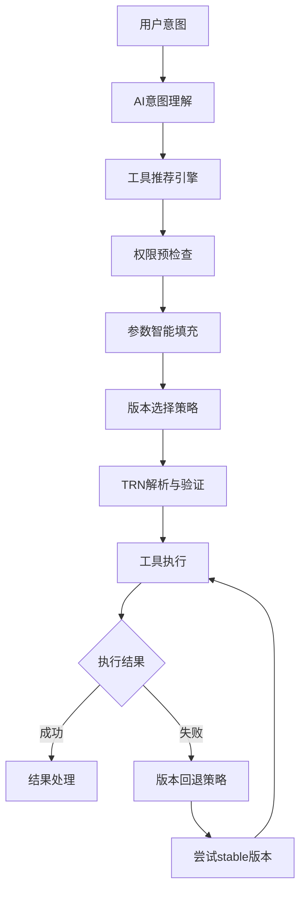

# AI Agent Platform 系统设计文档 v1.0

## 1. 系统概述

本系统是一个全AI agent控制的插件化平台，支持多种工具类型通过JSON RPC提供服务。核心特性包括：

- 统一的TRN资源标识系统
- 细粒度权限控制
- 插件化工具架构
- 全局搜索服务
- AI Brain智能调度

### 1.1 支持的工具类型

- **OpenAPI工具**: RESTful API调用
- **异步API工具**: 事件驱动API
- **工作流工具**: 复杂业务流程编排
- **系统工具**: 系统级操作
- **Python工具**: Python代码执行
- **Shell工具**: Shell命令执行

## 2. TRN (Tool Resource Name) 设计

### 2.1 TRN 格式规范 (优化版)

#### 2.1.1 统一资源标识格式

```
格式: trn:platform[:scope]:tool:tool_type[:subtype]:instance_id:version[:tag][@hash]
示例: trn:user:alice:tool:openapi:async:github-api:v1.0:beta@sha256:abc123
```

**资源类型扩展支持:**
```
工具资源: trn:user:alice:tool:openapi:github-api:v1.0
数据集: trn:org:company:dataset:customer-data:v2.0
流水线: trn:aiplatform:pipeline:ml-training:latest
模型: trn:user:bob:model:llm:chatbot:v3.0:gpu
```

#### 2.1.2 多租户平台支持

```
系统平台: trn:aiplatform:tool:openapi:github-api:v1.0
用户平台: trn:user:alice:tool:openapi:github-api:latest
组织平台: trn:org:company:tool:workflow:data-pipeline:v2.1:gpu
```

#### 2.1.3 URL 格式与编码规范

```
URL格式: trn://platform/[scope/]resource_type/type[/subtype]/instance_id/version[/tag][?hash=value]
标准示例: trn://aiplatform/tool/openapi/async/github-api/v1.0/beta?hash=sha256:abc123
编码示例: trn://user/alice/tool/openapi/my%2Dtool/v1.0
```

**URL编码规则 (基于RFC3986):**
- `/` → `%2F` (路径分隔符冲突时)
- `:` → `%3A` (在instance_id中使用时)  
- `.` → `%2E` (特殊上下文中)
- `-` → 保持原样 (推荐使用的分隔符)
- `@` → `%40` (在非hash位置使用时)

### 2.2 TRN 组件详细说明

| 组件 | 必填 | 描述 | 示例值 | 字符规则 |
|------|------|------|---------|----------|
| `platform` | 是 | 平台标识 | `aiplatform`, `user`, `org` | `[a-z][a-z0-9-]{1,31}` |
| `scope` | 否 | 租户/分组标识 | `alice`, `company`, `team-ai` | `[a-z0-9][a-z0-9-]{0,31}` |
| `resource_type` | 是 | 资源类型 | `tool`, `dataset`, `pipeline`, `model` | `[a-z][a-z0-9-]{1,15}` |
| `type` | 是 | 具体类型 | `openapi`, `workflow`, `python` | `[a-z][a-z0-9-]{1,31}` |
| `subtype` | 否 | 子类型 | `async`, `streaming`, `sync` | `[a-z][a-z0-9-]{1,31}` |
| `instance_id` | 是 | 实例唯一标识 | `github-api`, `slack-bot` | `[a-z0-9][a-z0-9-]{0,63}` |
| `version` | 是 | 版本号 | `v1.0.0`, `latest`, `stable` | `[a-z0-9][a-z0-9.-]{0,31}` |
| `tag` | 否 | 版本标签 | `beta`, `gpu`, `alpha` | `[a-z0-9][a-z0-9-]{0,15}` |
| `hash` | 否 | 内容指纹 | `sha256:abc123`, `md5:def456` | `[a-z0-9:]{8,71}` |

### 2.3 Schema Hash 与内容验证

#### 2.3.1 支持的Hash算法

| 算法 | 格式 | 用途 | 示例 |
|------|------|------|------|
| `SHA256` | `sha256:hex` | 内容完整性校验 | `sha256:a665a45920422f9d417e4867efdc4fb8a04a1f3fff1fa07e998e86f7f7a27ae3` |
| `MD5` | `md5:hex` | 快速内容校验 | `md5:5d41402abc4b2a76b9719d911017c592` |
| `CRC32` | `crc32:hex` | 轻量级校验 | `crc32:414fa339` |

#### 2.3.2 Hash使用场景

```
缓存一致性: trn:user:alice:tool:openapi:github-api:v1.0@sha256:abc123
版本验证: 确保获取的工具schema与注册时一致
LLM工具运行: 保证AI Agent使用的工具版本准确性
内容分发: CDN缓存基于hash的不可变内容
```

### 2.4 TRN 字符规则与校验

#### 2.4.1 字符集规范 (基于 RFC3986)

```regex
TRN格式正则: ^trn:([a-z][a-z0-9-]{1,31})(?::([a-z0-9][a-z0-9-]{0,31}))?:([a-z][a-z0-9-]{1,15}):([a-z][a-z0-9-]{1,31})(?::([a-z][a-z0-9-]{1,31}))?:([a-z0-9][a-z0-9-]{0,63}):([a-z0-9][a-z0-9.-]{0,31})(?::([a-z0-9][a-z0-9-]{0,15}))?(?:@([a-z0-9:]{8,71}))?$
```

#### 2.4.2 保留字段规范

- 禁止使用 `__` 开头的字段 (系统保留)
- 禁止使用 `system`, `internal`, `admin` 等保留词
- 大小写敏感，统一使用小写
- `tool`, `dataset`, `pipeline`, `model` 为预留资源类型

#### 2.4.3 安全校验规则

- 总长度限制: 256字符 (含hash)
- 防注入: 禁止 `../`, `./`, `/`, `\` 等路径字符  
- 防冲突: 每个组件不能为空或仅包含分隔符
- Hash验证: 可选但建议在生产环境使用

### 2.5 TRN 层次结构与通配符

```
# 平台级别
trn:aiplatform:*                                        # 系统所有资源
trn:user:*                                             # 所有用户资源
trn:org:company:*                                      # 特定组织所有资源

# 资源类型级别
trn:aiplatform:tool:*                                  # 系统所有工具
trn:user:alice:tool:openapi:*                          # 用户的所有OpenAPI工具
trn:org:company:dataset:*                              # 组织的所有数据集

# 具体类型级别
trn:user:alice:tool:openapi:async:*                    # 用户的异步OpenAPI工具

# 实例级别  
trn:aiplatform:tool:openapi:github-api:*               # GitHub API所有版本
trn:user:alice:tool:python:data-processor:*            # 用户工具所有版本

# 精确定位
trn:aiplatform:tool:openapi:async:github-api:v1.0:beta@sha256:abc123  # 带hash的精确版本
```

### 2.6 前端路由映射标准

#### 2.6.1 URL路径映射规则

```
TRN: trn:user:alice:tool:openapi:async:github-api:v1.0:beta@sha256:abc123
映射: /tools/user/alice/openapi/async/github-api/v1.0/beta?hash=sha256:abc123

路径格式: /tools/{platform}/{scope}/{type}/{subtype}/{instance}/{version}/{tag}
查询参数: ?hash={algorithm}:{value}
```

#### 2.6.2 前端页面功能

| 功能 | URL示例 | 描述 |
|------|---------|------|
| 工具详情 | `/tools/user/alice/openapi/github-api/v1.0` | 工具完整信息页面 |
| 工具测试 | `/tools/user/alice/openapi/github-api/v1.0/test` | 在线测试工具功能 |  
| 版本比较 | `/tools/user/alice/openapi/github-api/compare/v1.0/v2.0` | 版本差异对比 |
| AI推荐 | `/recommend?intent=github%20api` | AI工具推荐页面 |
| 文档生成 | `/tools/user/alice/openapi/github-api/v1.0/docs` | 自动生成的API文档 |

### 2.7 版本别名统一管理

#### 2.7.1 统一别名注册表

所有别名统一管理在 `trn_alias_registry` 中，避免分支冲突：

| 别名 | 实际版本 | 描述 | 自动更新 |
|------|----------|------|----------|
| `latest` | `v2.1.0` | 最新稳定版本 | ✅ |
| `stable` | `v2.0.0` | 长期支持版本 | ❌ |
| `beta` | `v2.2.0-beta.1` | 测试版本 | ✅ |
| `dev` | `v3.0.0-dev` | 开发版本 | ✅ |

#### 2.7.2 别名解析规则

```
输入: trn:user:alice:tool:openapi:github-api:latest
解析: trn:user:alice:tool:openapi:github-api:v2.1.0@sha256:abc123
```

#### 2.7.3 别名冲突解决策略

1. **优先级**: 用户别名 > 组织别名 > 系统别名
2. **版本锁定**: 关键环境使用精确版本，避免别名
3. **冲突告警**: 系统检测到别名冲突时主动通知
4. **AI推荐依赖**: AI Agent优先推荐已验证的别名版本

### 2.8 AI Agent Schema Embedding

#### 2.8.1 AI可解释结构定义

```json
{
  "trn_ai_schema": {
    "description": "工具资源名称，AI Agent用于理解和操作工具的核心标识",
    "purpose": "支持AI自动推荐、参数填充、工具组合等智能功能",
    "components": {
      "platform": {
        "description": "工具所属的平台类型，决定访问权限和资源隔离",
        "ai_relevance": "用于确定工具的可信度和访问策略",
        "values": {
          "aiplatform": "官方认证工具，高可信度，适合生产环境",
          "user": "用户私有工具，需验证权限，适合个人项目",
          "org": "组织共享工具，团队协作，需要组织权限验证"
        }
      },
      "resource_type": {
        "description": "资源的基础类型，影响AI的处理策略",
        "ai_usage": "决定AI如何理解和操作该资源",
        "categories": {
          "tool": "可执行工具，支持方法调用和参数传递",
          "dataset": "数据集资源，用于训练和分析",
          "pipeline": "工作流模板，支持复杂业务流程编排",
          "model": "AI模型资源，用于推理和预测"
        }
      },
      "type": {
        "description": "具体的工具类型，AI用于匹配用户意图",
        "ai_matching": "基于语义相似度进行工具推荐",
        "categories": {
          "openapi": "RESTful API工具，适合数据获取和服务调用",
          "workflow": "业务流程工具，适合复杂任务编排",
          "python": "代码执行工具，适合数据处理和计算",
          "shell": "系统命令工具，适合文件操作和系统管理"
        }
      },
      "embedding_vector": {
        "description": "工具功能的向量表示，用于相似度计算",
        "dimensions": 768,
        "model": "text-embedding-ada-002"
      }
    }
  }
}
```

#### 2.8.2 Embedding向量存储

```json
{
  "tool_embedding": {
    "trn": "trn:user:alice:tool:openapi:github-api:v1.0",
    "semantic_vector": [0.1, -0.2, 0.8, ...],
    "function_tags": ["api", "github", "repository", "version_control"],
    "capability_description": "GitHub API工具，支持仓库操作、issue管理、PR处理",
    "parameter_schema_embedding": [0.3, 0.1, -0.5, ...],
    "usage_examples": [
      {
        "intent": "获取仓库信息",
        "parameters": {"owner": "octocat", "repo": "Hello-World"},
        "expected_output": "repository metadata"
      }
    ]
  }
}
```

### 2.9 AI Agent 使用场景强化

#### 2.9.1 智能工具推荐

| 场景 | AI处理方式 | 示例 |
|------|------------|------|
| **意图匹配** | 语义向量检索 | "github tool" → `trn:*:tool:openapi:github-api:*` |
| **参数预填充** | Schema分析 + 上下文推理 | 根据OpenAPI schema自动生成表单 |
| **多工具串联** | 依赖关系分析 | 数据获取 → 处理 → 存储的工具链 |
| **权限预检查** | JWT Token范围验证 | 只推荐用户有权限的工具 |
| **版本推荐** | 稳定性评分 | 优先推荐 `stable` > `latest` > `beta` |
| **模糊纠错** | 编辑距离 + 语义相似度 | "github" → "github-api" |

#### 2.9.2 工具调用流程优化



#### 2.9.3 DSL工作流编排

```json
{
  "workflow_dsl": {
    "name": "GitHub数据分析流水线",
    "steps": [
      {
        "id": "fetch_repos",
        "trn": "trn:user:alice:tool:openapi:github-api:latest",
        "method": "list_repositories",
        "parameters": {"org": "{{input.organization}}"}
      },
      {
        "id": "analyze_data", 
        "trn": "trn:user:alice:tool:python:data-analyzer:stable",
        "method": "analyze_repositories",
        "parameters": {"repos": "{{fetch_repos.result}}"}
      },
      {
        "id": "generate_report",
        "trn": "trn:aiplatform:tool:workflow:report-generator:v2.0",
        "method": "create_report",
        "parameters": {"data": "{{analyze_data.result}}"}
      }
    ],
    "error_handling": {
      "retry_strategy": "exponential_backoff",
      "fallback_versions": ["stable", "v1.0"]
    }
  }
}
```

### 2.10 TRN 权限模型集成

#### 2.10.1 权限粒度映射

| TRN 组件 | 权限级别 | 示例 |
|----------|----------|------|
| `platform` | 平台级 | 系统管理员权限 |
| `platform:scope` | 租户级 | 组织管理员权限 |
| `resource_type` | 资源类型级 | 工具类资源管理权限 |
| `type` | 具体类型级 | OpenAPI工具管理权限 |
| `instance_id` | 实例级 | 特定工具的操作权限 |
| `version:tag` | 版本级 | 特定版本的访问权限 |

#### 2.10.2 权限继承规则

```
用户权限检查顺序 (新格式):
1. 精确匹配: trn:user:alice:tool:openapi:github-api:v1.0
2. 版本通配: trn:user:alice:tool:openapi:github-api:*
3. 实例通配: trn:user:alice:tool:openapi:*
4. 类型通配: trn:user:alice:tool:*
5. 资源通配: trn:user:alice:*
6. 租户通配: trn:user:*
7. 平台通配: trn:*
```

#### 2.10.3 JWT Token 权限绑定策略

**Token中嵌入TRN访问范围:**
```json
{
  "sub": "user:alice",
  "iat": 1640995200,
  "exp": 1641081600,
  "trn_scopes": [
    "trn:user:alice:*",
    "trn:org:company:tool:*",
    "trn:aiplatform:tool:openapi:*:READ"
  ],
  "rate_limits": {
    "trn:user:alice:*": "1000/hour",
    "trn:org:company:*": "5000/hour"
  },
  "capabilities": ["EXECUTE", "READ"],
  "exclude_patterns": [
    "trn:*:*:*:*:*:*:*:admin",
    "trn:*:*:*:*:*:*:*:internal"
  ]
}
```

**边缘/Agent环境优化:**
- 减少权限查询次数，提升响应速度
- 支持离线权限验证
- 动态权限范围更新
- 细粒度访问控制

## 3. 权限控制设计

### 3.1 权限模型架构

采用 **RBAC + 资源级权限** 混合模型：

```
用户 (User) ←→ 角色 (Role) ←→ 权限 (Permission) ←→ 资源 (TRN)
     ↓                                ↓
  直接权限                          策略规则
```

### 3.2 权限层次结构

#### 3.2.1 操作权限 (Actions)

| 权限 | 描述 | 适用资源 |
|------|------|----------|
| `READ` | 读取权限 | 所有资源 |
| `EXECUTE` | 执行权限 | 工具实例 |
| `WRITE` | 写入权限 | 工具配置 |
| `DELETE` | 删除权限 | 工具实例 |
| `ADMIN` | 管理权限 | 系统级资源 |

#### 3.2.2 资源权限范围

| 范围级别 | TRN模式 | 示例 |
|----------|---------|------|
| 全局 | `trn:aiplatform:*` | 平台管理员 |
| 工具类型 | `trn:aiplatform:openapi:*` | OpenAPI工具管理 |
| 实例 | `trn:aiplatform:openapi:github-api:*` | 特定工具实例 |
| 版本 | `trn:aiplatform:openapi:github-api:v1.0` | 特定版本 |

### 3.3 预定义角色

| 角色名 | 描述 | 权限范围 |
|--------|------|----------|
| `system_admin` | 系统管理员 | `trn:aiplatform:*` (所有权限) |
| `tool_admin` | 工具管理员 | 特定工具类型的管理权限 |
| `developer` | 开发者 | 工具的读取和执行权限 |
| `user` | 普通用户 | 基础工具执行权限 |
| `readonly` | 只读用户 | 仅读取权限 |

## 4. 数据库表设计

### 4.1 用户管理表

#### 4.1.1 users 表

| 字段名 | 类型 | 约束 | 描述 |
|--------|------|------|------|
| `id` | VARCHAR(36) | PRIMARY KEY | 用户ID (UUID) |
| `username` | VARCHAR(50) | UNIQUE NOT NULL | 用户名 |
| `email` | VARCHAR(100) | UNIQUE NOT NULL | 邮箱 |
| `password_hash` | VARCHAR(255) | NOT NULL | 密码哈希 |
| `display_name` | VARCHAR(100) | | 显示名称 |
| `status` | ENUM | NOT NULL | 用户状态 (active/inactive/suspended) |
| `attributes` | JSON | | 用户属性 |
| `created_at` | TIMESTAMP | DEFAULT NOW() | 创建时间 |
| `updated_at` | TIMESTAMP | DEFAULT NOW() | 更新时间 |

#### 4.1.2 roles 表

| 字段名 | 类型 | 约束 | 描述 |
|--------|------|------|------|
| `id` | VARCHAR(36) | PRIMARY KEY | 角色ID |
| `name` | VARCHAR(50) | UNIQUE NOT NULL | 角色名称 |
| `description` | TEXT | | 角色描述 |
| `parent_role_id` | VARCHAR(36) | FK | 父角色ID (权限继承) |
| `is_system` | BOOLEAN | DEFAULT FALSE | 是否系统角色 |
| `created_at` | TIMESTAMP | DEFAULT NOW() | 创建时间 |
| `updated_at` | TIMESTAMP | DEFAULT NOW() | 更新时间 |

#### 4.1.3 user_roles 表

| 字段名 | 类型 | 约束 | 描述 |
|--------|------|------|------|
| `id` | VARCHAR(36) | PRIMARY KEY | 关联ID |
| `user_id` | VARCHAR(36) | FK NOT NULL | 用户ID |
| `role_id` | VARCHAR(36) | FK NOT NULL | 角色ID |
| `granted_by` | VARCHAR(36) | FK | 授权人ID |
| `granted_at` | TIMESTAMP | DEFAULT NOW() | 授权时间 |
| `expires_at` | TIMESTAMP | | 过期时间 |

### 4.2 工具管理表

#### 4.2.1 tools 表 (AI增强版)

| 字段名 | 类型 | 约束 | 描述 |
|--------|------|------|------|
| `id` | VARCHAR(36) | PRIMARY KEY | 工具ID |
| `trn` | VARCHAR(256) | UNIQUE NOT NULL | 完整工具TRN |
| `platform` | VARCHAR(32) | NOT NULL | 平台标识 |
| `scope` | VARCHAR(32) | | 租户/分组标识 |
| `resource_type` | VARCHAR(16) | NOT NULL DEFAULT 'tool' | 资源类型 |
| `type` | VARCHAR(32) | NOT NULL | 具体类型 |
| `subtype` | VARCHAR(32) | | 子类型 |
| `instance_id` | VARCHAR(64) | NOT NULL | 实例标识 |
| `version` | VARCHAR(32) | NOT NULL | 版本号 |
| `tag` | VARCHAR(16) | | 版本标签 |
| `hash` | VARCHAR(71) | | 内容指纹 |
| `name` | VARCHAR(100) | NOT NULL | 工具名称 |
| `description` | TEXT | | 工具描述 |
| `schema` | JSON | NOT NULL | 参数schema |
| `schema_hash` | VARCHAR(64) | | Schema内容hash |
| `capabilities` | JSON | | 能力列表 |
| `endpoints` | JSON | | 端点信息 |
| `metadata` | JSON | | 元数据 |
| `ai_description` | JSON | | AI可解释描述 |
| `embedding_vector` | VECTOR(768) | | 语义向量 |
| `function_tags` | JSON | | 功能标签数组 |
| `usage_examples` | JSON | | 使用示例 |
| `status` | ENUM | NOT NULL | 状态 (active/inactive/deprecated) |
| `owner_id` | VARCHAR(36) | FK | 所有者ID |
| `created_at` | TIMESTAMP | DEFAULT NOW() | 创建时间 |
| `updated_at` | TIMESTAMP | DEFAULT NOW() | 更新时间 |

**索引设计:**
```sql
-- 复合索引用于快速查询
CREATE INDEX idx_tools_platform_scope ON tools(platform, scope);
CREATE INDEX idx_tools_resource_type ON tools(resource_type, type, subtype);
CREATE INDEX idx_tools_instance_version ON tools(instance_id, version);
-- TRN组件查询索引
CREATE INDEX idx_tools_trn_components ON tools(platform, resource_type, type, instance_id);
-- AI相关索引
CREATE INDEX idx_tools_function_tags ON tools USING GIN(function_tags);
-- 向量相似度索引 (需要向量数据库扩展)
CREATE INDEX idx_tools_embedding ON tools USING ivfflat(embedding_vector) WITH (lists = 100);
```

#### 4.2.1.1 tool_embeddings 表 (专用向量存储)

| 字段名 | 类型 | 约束 | 描述 |
|--------|------|------|------|
| `id` | VARCHAR(36) | PRIMARY KEY | 向量记录ID |
| `tool_id` | VARCHAR(36) | FK NOT NULL | 关联工具ID |
| `trn` | VARCHAR(256) | NOT NULL | 工具TRN |
| `embedding_type` | VARCHAR(32) | NOT NULL | 向量类型 (semantic/parameter/usage) |
| `vector` | VECTOR(768) | NOT NULL | 向量数据 |
| `model_version` | VARCHAR(32) | | 生成模型版本 |
| `created_at` | TIMESTAMP | DEFAULT NOW() | 创建时间 |

**向量索引:**
```sql
-- 不同类型的向量索引
CREATE INDEX idx_semantic_vectors ON tool_embeddings USING ivfflat(vector) WHERE embedding_type = 'semantic';
CREATE INDEX idx_parameter_vectors ON tool_embeddings USING ivfflat(vector) WHERE embedding_type = 'parameter';
```

#### 4.2.2 tool_version_aliases 表

| 字段名 | 类型 | 约束 | 描述 |
|--------|------|------|------|
| `id` | VARCHAR(36) | PRIMARY KEY | 别名ID |
| `tool_base_trn` | VARCHAR(200) | NOT NULL | 工具基础TRN(不含版本) |
| `alias_name` | VARCHAR(32) | NOT NULL | 别名 (latest/stable/beta) |
| `target_version` | VARCHAR(32) | NOT NULL | 目标版本号 |
| `target_tag` | VARCHAR(16) | | 目标标签 |
| `description` | TEXT | | 别名描述 |
| `is_auto_update` | BOOLEAN | DEFAULT FALSE | 是否自动更新 |
| `created_at` | TIMESTAMP | DEFAULT NOW() | 创建时间 |
| `updated_at` | TIMESTAMP | DEFAULT NOW() | 更新时间 |

**约束:**
```sql
-- 确保工具的别名唯一性
CONSTRAINT uk_tool_alias UNIQUE (tool_base_trn, alias_name)
```

#### 4.2.3 tool_executions 表

| 字段名 | 类型 | 约束 | 描述 |
|--------|------|------|------|
| `id` | VARCHAR(36) | PRIMARY KEY | 执行ID |
| `tool_trn` | VARCHAR(256) | NOT NULL | 工具TRN |
| `resolved_trn` | VARCHAR(256) | NOT NULL | 解析后的实际TRN |
| `user_id` | VARCHAR(36) | FK NOT NULL | 执行用户 |
| `method` | VARCHAR(100) | NOT NULL | 调用方法 |
| `parameters` | JSON | | 调用参数 |
| `result` | JSON | | 执行结果 |
| `status` | ENUM | NOT NULL | 状态 (pending/running/success/failed) |
| `execution_time` | INTEGER | | 执行时间(毫秒) |
| `error_message` | TEXT | | 错误信息 |
| `context` | JSON | | 执行上下文 |
| `created_at` | TIMESTAMP | DEFAULT NOW() | 创建时间 |
| `completed_at` | TIMESTAMP | | 完成时间 |

### 4.3 权限管理表

#### 4.3.1 permissions 表

| 字段名 | 类型 | 约束 | 描述 |
|--------|------|------|------|
| `id` | VARCHAR(36) | PRIMARY KEY | 权限ID |
| `name` | VARCHAR(100) | UNIQUE NOT NULL | 权限名称 |
| `resource_pattern` | VARCHAR(256) | NOT NULL | 资源模式 |
| `action` | VARCHAR(50) | NOT NULL | 操作类型 |
| `effect` | ENUM | NOT NULL | 效果 (allow/deny) |
| `conditions` | JSON | | 权限条件 |
| `description` | TEXT | | 权限描述 |
| `is_system` | BOOLEAN | DEFAULT FALSE | 是否系统权限 |
| `created_at` | TIMESTAMP | DEFAULT NOW() | 创建时间 |

#### 4.3.2 role_permissions 表

| 字段名 | 类型 | 约束 | 描述 |
|--------|------|------|------|
| `id` | VARCHAR(36) | PRIMARY KEY | 关联ID |
| `role_id` | VARCHAR(36) | FK NOT NULL | 角色ID |
| `permission_id` | VARCHAR(36) | FK NOT NULL | 权限ID |
| `granted_at` | TIMESTAMP | DEFAULT NOW() | 授权时间 |

#### 4.3.3 user_permissions 表

| 字段名 | 类型 | 约束 | 描述 |
|--------|------|------|------|
| `id` | VARCHAR(36) | PRIMARY KEY | 关联ID |
| `user_id` | VARCHAR(36) | FK NOT NULL | 用户ID |
| `permission_id` | VARCHAR(36) | FK NOT NULL | 权限ID |
| `resource_trn` | VARCHAR(256) | | 特定资源TRN |
| `granted_by` | VARCHAR(36) | FK | 授权人ID |
| `granted_at` | TIMESTAMP | DEFAULT NOW() | 授权时间 |
| `expires_at` | TIMESTAMP | | 过期时间 |

### 4.4 审计日志表

#### 4.4.1 audit_logs 表

| 字段名 | 类型 | 约束 | 描述 |
|--------|------|------|------|
| `id` | VARCHAR(36) | PRIMARY KEY | 日志ID |
| `user_id` | VARCHAR(36) | FK | 用户ID |
| `resource_trn` | VARCHAR(256) | NOT NULL | 访问资源 |
| `action` | VARCHAR(50) | NOT NULL | 执行操作 |
| `result` | ENUM | NOT NULL | 访问结果 (success/denied/error) |
| `ip_address` | VARCHAR(45) | | IP地址 |
| `user_agent` | TEXT | | 用户代理 |
| `session_id` | VARCHAR(36) | | 会话ID |
| `reason` | TEXT | | 拒绝/错误原因 |
| `created_at` | TIMESTAMP | DEFAULT NOW() | 访问时间 |

### 4.5 会话管理表

#### 4.5.1 sessions 表

| 字段名 | 类型 | 约束 | 描述 |
|--------|------|------|------|
| `id` | VARCHAR(36) | PRIMARY KEY | 会话ID |
| `user_id` | VARCHAR(36) | FK NOT NULL | 用户ID |
| `token_hash` | VARCHAR(255) | UNIQUE NOT NULL | 令牌哈希 |
| `ip_address` | VARCHAR(45) | | IP地址 |
| `user_agent` | TEXT | | 用户代理 |
| `expires_at` | TIMESTAMP | NOT NULL | 过期时间 |
| `created_at` | TIMESTAMP | DEFAULT NOW() | 创建时间 |
| `last_accessed` | TIMESTAMP | DEFAULT NOW() | 最后访问时间 |

## 5. 核心接口设计

### 5.1 JSON RPC 接口规范

#### 5.1.1 请求格式

```json
{
  "jsonrpc": "2.0",
  "method": "namespace.method_name",
  "params": {
    "param1": "value1",
    "param2": "value2"
  },
  "id": "request_id"
}
```

#### 5.1.2 响应格式

```json
{
  "jsonrpc": "2.0",
  "result": {
    "data": "response_data"
  },
  "id": "request_id"
}
```

#### 5.1.3 错误响应格式

```json
{
  "jsonrpc": "2.0",
  "error": {
    "code": -32000,
    "message": "Error description",
    "data": {
      "details": "Additional error details"
    }
  },
  "id": "request_id"
}
```

### 5.2 核心接口方法

#### 5.2.1 TRN 管理接口 (优化版)

| 方法 | 描述 | 参数 | 返回值 |
|------|------|------|--------|
| `trn.generate` | 生成TRN | `TrnComponents` | `trn`, `validation_result` |
| `trn.validate` | 验证TRN格式 | `trn` | `valid`, `error_details?`, `suggestions?` |
| `trn.parse` | 解析TRN组件 | `trn` | `TrnComponents` |
| `trn.resolve` | 解析别名到实际版本 | `trn_with_alias` | `resolved_trn`, `alias_info?` |
| `trn.normalize` | 标准化TRN格式 | `trn_input` | `normalized_trn` |
| `trn.to_url` | 转换为URL格式 | `trn` | `trn_url` |
| `trn.from_url` | 从URL解析TRN | `trn_url` | `trn` |
| `trn.check_permissions` | 检查TRN权限 | `user_id`, `trn`, `action` | `allowed`, `effective_permissions` |

**TrnComponents 数据结构:**
```json
{
  "platform": "aiplatform",
  "scope": "alice",        // 可选
  "tool_type": "openapi",
  "subtype": "async",      // 可选
  "instance_id": "github-api",
  "version": "v1.0.0",
  "tag": "beta"           // 可选
}
```

#### 5.2.2 版本别名管理接口

| 方法 | 描述 | 参数 | 返回值 |
|------|------|------|--------|
| `alias.create` | 创建版本别名 | `AliasCreation` | `alias_id` |
| `alias.update` | 更新别名目标 | `alias_id`, `target_version`, `target_tag?` | `success` |
| `alias.delete` | 删除别名 | `alias_id` | `success` |
| `alias.list` | 列出工具别名 | `tool_base_trn` | `aliases[]` |
| `alias.resolve` | 解析别名 | `tool_base_trn`, `alias_name` | `target_version`, `target_tag?` |
| `alias.auto_update` | 自动更新别名 | `alias_id`, `new_version` | `success` |

**AliasCreation 数据结构:**
```json
{
  "tool_base_trn": "trn:user:alice:openapi:github-api",
  "alias_name": "latest",
  "target_version": "v2.1.0",
  "target_tag": "stable",
  "description": "最新稳定版本",
  "is_auto_update": true
}
```

#### 5.2.3 工具调用接口 (优化版)

| 方法 | 描述 | 参数 | 返回值 |
|------|------|------|--------|
| `invoke.tool` | 调用工具 | `ToolInvocation` | `ToolResult` |
| `invoke.async` | 异步调用工具 | `ToolInvocation` | `task_id`, `estimated_duration?` |
| `invoke.status` | 查询任务状态 | `task_id` | `TaskStatus` |
| `invoke.cancel` | 取消任务 | `task_id` | `success`, `reason?` |
| `invoke.batch` | 批量调用 | `BatchInvocation` | `batch_id`, `task_ids[]` |

**ToolInvocation 数据结构:**
```json
{
  "trn": "trn:user:alice:openapi:github-api:latest",
  "method": "get_repository",
  "parameters": {
    "owner": "octocat",
    "repo": "Hello-World"
  },
  "context": {
    "timeout": 30000,
    "retry_count": 3,
    "cache_enabled": true
  },
  "resolve_alias": true
}
```

**ToolResult 数据结构:**
```json
{
  "success": true,
  "data": { /* 返回数据 */ },
  "resolved_trn": "trn:user:alice:openapi:github-api:v2.1.0",
  "execution_time": 1250,
  "metadata": {
    "cache_hit": false,
    "api_calls": 1,
    "quota_remaining": 4999
  },
  "error": null
}
```

#### 5.2.4 AI智能接口

| 方法 | 描述 | 参数 | 返回值 |
|------|------|------|--------|
| `ai.recommend_tools` | 推荐工具 | `user_intent`, `context?` | `recommendations[]` |
| `ai.explain_trn` | 解释TRN含义 | `trn` | `explanation`, `usage_examples[]` |
| `ai.suggest_workflow` | 建议工作流 | `goal`, `available_tools[]` | `workflow_steps[]` |
| `ai.optimize_call` | 优化调用参数 | `trn`, `method`, `raw_params` | `optimized_params`, `warnings[]` |

#### 5.2.5 权限验证接口 (增强版)

| 方法 | 描述 | 参数 | 返回值 |
|------|------|------|--------|
| `auth.login` | 用户登录 | `credentials` | `AuthResult` |
| `auth.logout` | 用户登出 | `token` | `success` |
| `auth.refresh` | 刷新令牌 | `refresh_token` | `new_token`, `expires_at` |
| `auth.check_trn` | 检查TRN权限 | `token`, `trn`, `action` | `PermissionResult` |
| `auth.bulk_check` | 批量权限检查 | `token`, `permission_requests[]` | `results[]` |
| `auth.get_accessible_trns` | 获取可访问TRN | `token`, `filters?` | `accessible_trns[]` |

**PermissionResult 数据结构:**
```json
{
  "allowed": true,
  "reason": "User has EXECUTE permission via role 'developer'",
  "effective_permissions": ["READ", "EXECUTE"],
  "limitations": {
    "rate_limit": "100/hour",
    "quota": "1000/day"
  },
  "expires_at": "2024-12-31T23:59:59Z"
}
```

### 5.3 错误代码规范 (扩展版)

| 错误代码 | 分类 | 描述 | 示例 |
|----------|------|------|------|
| `-32000` | TRN错误 | TRN格式无效 | 字符集不符合规范 |
| `-32001` | TRN错误 | TRN组件缺失 | 缺少必填的 platform 字段 |
| `-32002` | TRN错误 | TRN长度超限 | 总长度超过256字符 |
| `-32003` | TRN错误 | 别名解析失败 | latest 别名不存在 |
| `-32010` | 工具错误 | 工具注册失败 | schema 验证不通过 |
| `-32011` | 工具错误 | 工具不存在 | 指定TRN的工具未注册 |
| `-32012` | 工具错误 | 工具调用失败 | 方法执行异常 |
| `-32013` | 工具错误 | 工具版本冲突 | 版本依赖不满足 |
| `-32020` | 权限错误 | 权限不足 | 用户无执行权限 |
| `-32021` | 权限错误 | 认证失败 | 令牌无效或过期 |
| `-32022` | 权限错误 | 权限策略冲突 | 同时存在允许和拒绝策略 |
| `-32023` | 权限错误 | 租户隔离违规 | 跨租户访问被禁止 |
| `-32030` | 系统错误 | 资源不存在 | 用户或角色不存在 |
| `-32031` | 系统错误 | 参数无效 | 请求参数格式错误 |
| `-32032` | 系统错误 | 服务不可用 | 依赖服务超时 |
| `-32033` | 系统错误 | 配额限制 | 超出调用频率限制 |
| `-32040` | AI错误 | 推荐失败 | AI模型服务异常 |
| `-32041` | AI错误 | 解释生成失败 | 无法生成TRN说明 |

### 5.4 JSON RPC 命名空间 (更新版)

| 命名空间 | 示例方法 | 描述 |
|----------|----------|------|
| `trn` | `trn.generate`, `trn.validate`, `trn.resolve` | TRN核心管理 |
| `alias` | `alias.create`, `alias.update`, `alias.resolve` | 版本别名管理 |
| `invoke` | `invoke.tool`, `invoke.async`, `invoke.batch` | 工具调用服务 |
| `auth` | `auth.login`, `auth.check_trn`, `auth.bulk_check` | 认证授权服务 |
| `ai` | `ai.recommend_tools`, `ai.explain_trn` | AI智能服务 |
| `registry` | `registry.register_tool`, `registry.list_tools` | 工具注册管理 |
| `search` | `search.tools`, `search.capabilities` | 搜索服务 |
| `admin` | `admin.manage_users`, `admin.system_status` | 系统管理 |

## 6. 系统架构设计

### 6.1 技术栈

- **后端**: Rust + Tokio + Serde + SQLx
- **数据库**: PostgreSQL
- **前端**: Flutter + Dart
- **通信**: JSON RPC over WebSocket/HTTP
- **缓存**: Redis (可选)

### 6.2 模块划分

```
backend/
├── core_engine/          # 核心引擎
├── trn_system/           # TRN管理
├── auth_service/         # 认证授权
├── tool_registry/        # 工具注册
├── search_service/       # 搜索服务
├── json_rpc/            # RPC服务器
├── ai_brain/            # AI大脑
└── tools/               # 工具实现
    ├── openapi_tool/
    ├── workflow_tool/
    ├── python_tool/
    ├── shell_tool/
    ├── system_tool/
    └── async_api_tool/
```

### 6.3 数据流架构

```
Flutter UI → JSON RPC → Auth Service → Tool Registry → Tool Instance
     ↑                       ↓                ↓
  WebSocket ←─── AI Brain ←── Search Service ←┘
```

## 7. 安全考虑

### 7.1 认证安全

- JWT令牌认证
- 令牌自动刷新机制
- 会话超时控制
- IP地址绑定(可选)

### 7.2 权限安全

- 最小权限原则
- 权限继承控制
- 动态权限验证
- 审计日志记录

### 7.3 通信安全

- TLS/SSL加密传输
- 请求签名验证
- 防重放攻击
- 速率限制

## 8. 部署架构

### 8.1 单机部署

```
Docker Container:
├── Rust Backend (Port 8080)
├── PostgreSQL (Port 5432)
├── Redis (Port 6379, 可选)
└── Flutter Web (Nginx, Port 80)
```

### 8.2 分布式部署

```
Load Balancer → Backend Cluster → Database Cluster
                      ↓
                 Redis Cluster
```

## 9. 监控与运维

### 9.1 监控指标

- API调用次数和延迟
- 工具执行成功率
- 权限验证通过率
- 系统资源使用率

### 9.2 日志管理

- 结构化日志输出
- 日志级别控制
- 日志轮转策略
- 错误告警机制

## 10. 未来扩展

### 10.1 计划功能

- 工具版本管理
- 工作流可视化编辑器
- 批量工具调用
- 工具性能分析

### 10.2 技术演进

- 微服务架构迁移
- 容器化部署优化
- 多租户支持
- 国际化支持

## 11. 优化增强总结

### 11.1 核心增强功能

#### ✅ TRN格式统一化
- **新格式**: `trn:platform[:scope]:tool:type[:subtype]:instance:version[:tag][@hash]`
- **资源扩展**: 支持 tool/dataset/pipeline/model 多种资源类型
- **多租户**: user/org/aiplatform 三级平台隔离
- **内容验证**: SHA256/MD5/CRC32 hash校验

#### ✅ AI适配性强化
- **语义向量**: 768维embedding支持相似度检索
- **智能推荐**: 基于意图匹配的工具推荐引擎
- **参数预填充**: OpenAPI schema自动表单生成
- **工作流DSL**: 支持多工具串联编排
- **版本回退**: 失败时自动尝试stable版本

#### ✅ 权限模型优化
- **JWT绑定**: Token中嵌入TRN访问范围
- **7层继承**: 从精确匹配到平台通配的权限检查
- **边缘优化**: 减少权限查询，支持离线验证
- **细粒度控制**: 支持到版本级别的权限管理

#### ✅ 前端集成标准
- **URL映射**: `/tools/{platform}/{scope}/{type}/{instance}/{version}`
- **功能页面**: 详情/测试/比较/推荐/文档自动生成
- **复制跳转**: 支持 trn:// 协议直接跳转

#### ✅ 版本管理增强
- **统一别名**: trn_alias_registry 避免冲突
- **自动更新**: latest/beta 别名自动指向新版本
- **冲突解决**: 用户 > 组织 > 系统的优先级策略

### 11.2 AI Agent 场景支持

| 功能 | 实现方式 | 业务价值 |
|------|----------|----------|
| **工具推荐** | 语义向量检索 + 权限预检 | 降低工具发现成本，提升开发效率 |
| **参数智能填充** | Schema解析 + 上下文推理 | 减少手动配置，降低使用门槛 |
| **多工具编排** | DSL工作流 + 依赖分析 | 支持复杂业务场景，提升自动化程度 |
| **模糊纠错** | 编辑距离 + 语义相似度 | 提升用户体验，容错性更强 |
| **版本优化** | 稳定性评分 + 自动回退 | 保证服务可靠性，减少故障影响 |

### 11.3 技术架构优势

#### 🚀 性能优化
- **向量检索**: pgvector扩展支持高效相似度查询
- **索引优化**: GIN/ivfflat复合索引提升查询性能
- **缓存策略**: Schema hash实现内容级缓存
- **权限缓存**: JWT Token减少数据库查询

#### 🔒 安全增强
- **字符规范**: RFC3986兼容，防注入攻击
- **权限隔离**: 多租户数据完全隔离
- **内容校验**: Hash验证确保数据完整性
- **访问控制**: 细粒度权限到版本级别

#### 🎯 AI原生设计
- **可解释性**: 结构化schema便于AI理解
- **向量化**: 支持语义搜索和相似度匹配
- **工作流**: DSL支持AI自动化编排
- **学习能力**: 使用示例支持模型训练

### 11.4 未来扩展规划

#### 🔮 短期目标 (3个月)
- [ ] 实现基础TRN解析和验证
- [ ] 部署向量数据库和embedding服务
- [ ] 完成权限系统和JWT集成
- [ ] 开发AI推荐原型

#### 🚀 中期目标 (6个月)
- [ ] 完善工作流DSL引擎
- [ ] 集成多种AI模型服务
- [ ] 实现前端路由映射
- [ ] 优化性能和缓存策略

#### 🌟 长期愿景 (1年)
- [ ] 支持更多资源类型 (dataset/pipeline/model)
- [ ] 实现跨平台TRN互操作
- [ ] 建立工具生态市场
- [ ] AI Agent完全自主化

---

**文档版本**: v1.1 (AI增强版)  
**创建日期**: 2024年12月  
**最后更新**: 2024年12月  
**维护者**: 系统架构团队 